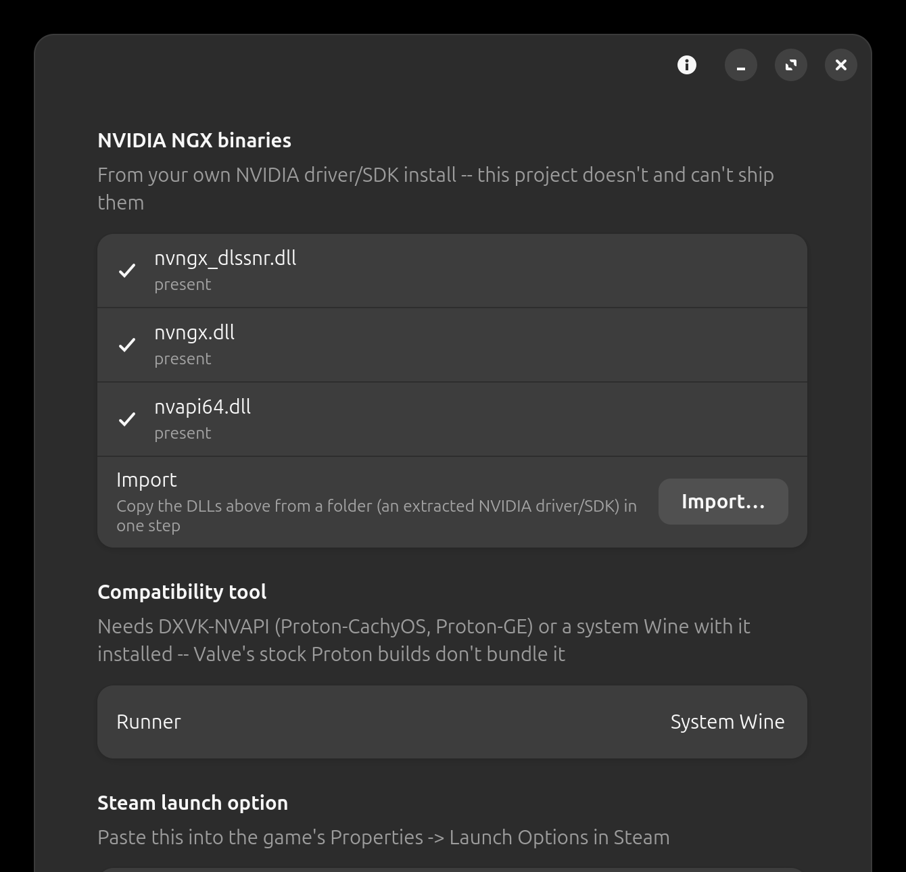

# Neural Forge

Neural Forge is a Linux Vulkan implicit layer plus Windows helper that forwards presented frames to
NVIDIA's DLSS 5 Neural Rendering model, running the model itself under Wine/Proton.
Written in Rust with GTK4 and libadwaita. A from-scratch rebuild of
[DLSS5VKLayer](https://github.com/bmitch87/DLSS5VKLayer)'s architecture, not a fork —
see [ATTRIBUTION.md](ATTRIBUTION.md) for exactly what that means and where the ideas
came from.

This is experimental, personal-use software. It works around an authorization check in
NVIDIA's proprietary NGX DLL to run the model outside its intended integration path —
see [Legal](#legal) before you use it.

Repository: [labj1987/neural-forge](https://github.com/labj1987/neural-forge).

## Screenshots

| Settings | Setup |
|---|---|
|  |  |

## What it does

- A Vulkan implicit layer hooks presentation for native Linux and Proton games. Each
  presented frame is captured, answered by the model and composited back onto that same
  frame before it is shown (synchronous present), so an answer is never pasted onto a later
  frame -- which is what used to ghost whenever the camera moved. The wait is bounded
  (250 ms): a slow, missing or restarting helper means that frame is shown untouched.
  `NEURAL_FORGE_PIPELINED=1` restores the older pipelined mode (higher frame rate, ghosts).
- Start order does not matter: the helper can be started before or after the game, and
  stopped or restarted while it runs. The layer stays out of the way until the game has
  rendered steadily for 5 seconds, and steps back out on loading screens.
- Any resolution: the model never works on more than 3840x2160 pixels (anything larger is
  scaled down for it and the answer scaled back up), and odd-sized frames are handled.
- Fail-open: if the helper isn't running or the model fails to initialize, the layer
  just presents the original frame — nothing about the game's rendering depends on it.
- The Windows-side helper runs NVIDIA's `nvngx_dlssnr.dll` (Feature 18) under Wine or a
  Proton build. The experimental `VK_NV_optical_flow` motion path is disabled in
  the known-good baseline.
- SDR 8-bit swapchains only (B8G8R8A8 / R8G8B8A8, UNORM or sRGB); the validated GTA
  baseline is SDR B8G8R8A8. HDR (PQ 10-bit) and float16 swapchains are recognised and logged
  but present untouched for now — the half-float compose path is a tracked follow-up.
- A composition pass blends the model's output back into the frame — tone/structure/
  skin/sharpness controls (applied when the model's feature is built; changing one rebuilds
  it), multiple model passes, and a reversible neutral-axis proxy mode. The model can work
  below the frame's resolution (faster, softer); supersampling above it is not available. The colour math in `composition/color.rs` is rederived
  independently from public sources (the one clean-room file); the proxy encode
  (`encode.comp`) and the composition guard in `compose.comp` are ported from
  DLSS5VKLayer's `dlssnr.hlsl` — see ATTRIBUTION.md.
- An in-game toggle key (default F11; `NEURAL_FORGE_TOGGLE_KEY` overrides), read through
  evdev when the user is in the `input` group and XInput2 raw keys otherwise.
- Inert on non-NVIDIA GPUs (hybrid laptops' integrated GPU is left alone) and when a second
  copy of the layer is loaded.
- GTK4/libadwaita settings app for all of the above, live-bound to the running layer
  over the same shared-memory segment.
- A CLI (`neural-forge-cli`) for runner discovery, starting/stopping the helper, status,
  diagnostics, importing the NVIDIA NGX DLLs, and raw settings introspection
  (`shmctl status`/`set`/`toggle`/`capture`) — no bash script, no root step.
- Everything lives under `~/.local/share`, `~/.config`, and `/tmp/neural-forge-$UID/`. No
  polkit, no pkexec, no privileged install step at all.

## Requirements

- x86_64 Linux, NVIDIA GPU and driver, Vulkan loader.
- A Wine install or a Steam compatibility tool that bundles DXVK-NVAPI (e.g.
  Proton-CachyOS, Proton-GE) to run the Windows-side helper. Valve's stock Proton
  builds don't bundle DXVK-NVAPI, so they aren't a supported runner.
- NVIDIA's own NGX DLLs, which this project doesn't and can't ship — see below.

## Install

Download the AppImage from [Releases](https://github.com/labj1987/neural-forge/releases):

```bash
chmod +x neural-forge-*-x86_64.AppImage
./neural-forge-*-x86_64.AppImage
```

For Steam games launched separately from the GUI, install the extracted AppDir into
persistent user storage so Vulkan can find the layer after the AppImage exits:

```bash
python3 scripts/install.py install --appdir build-appimage/AppDir
```

The GUI is `neural-forge`; the CLI is `neural-forge-cli`; the Windows helper is
`neural-forge-helper.exe`. Config, data, state, runtime, control mapping and helper
prefix live under `neural-forge` locations (`~/.config/neural-forge`,
`~/.local/share/neural-forge`, `~/.local/state/neural-forge`, `/tmp/neural-forge-$UID/`);
an install from before 0.1.77 is migrated automatically on first start. Upstream DLSS5VKLayer can remain
installed; Neural Forge neither migrates ambiguous upstream state nor changes its
files, configuration, launch options, helper, or runtime. See
[docs/PHASE1.md](docs/PHASE1.md) for executable targeting, migration and uninstall.

## Usage

`nvngx_dlssnr.dll` is NVIDIA's proprietary model binary and isn't included here. Get it
from your own NVIDIA driver/SDK install and import it with:

```bash
neural-forge-cli import-binaries /path/to/dlls
```

or from the GUI's binaries import flow. Files are copied into
`$XDG_DATA_HOME/neural-forge/binaries`; restart the helper afterward.

Add `NEURAL_FORGE_ENABLE=1` (and, for a specific target executable in a multi-process
game, `NEURAL_FORGE_TARGET_EXE=<name>.exe`) to a game's Steam launch options to
activate the layer. GUI and layer share live settings over the same shared-memory
segment; `neural-forge-cli shmctl status/set/toggle/capture` covers the same controls
from a terminal.

## Status

Validated on GTA V Enhanced (RTX 5070, driver `615.71.09`): the render tap correctly
captures GTA's own render target while leaving Rockstar Launcher, Social Club, Wine
Explorer, Xalia and overlays pass-through, and the full model/helper round-trip runs
end to end. Measured at 2560x1440 with the model at full resolution: about 35 fps with the
effect on (the game alone runs at about 77). The limit is the game's and the model's GPU
time on one card, not the layer (about 2 ms of its own per frame); lowering the model
resolution (`working_scale`) trades detail for speed (44 fps at 75%, 57 at 50%) — see [docs/HARDWARE_VALIDATION.md](docs/HARDWARE_VALIDATION.md) for
measurements, [docs/RENDER_TAP_DESIGN.md](docs/RENDER_TAP_DESIGN.md) for the capture
constraints, and [docs/ASYNC_CAPTURE_DESIGN.md](docs/ASYNC_CAPTURE_DESIGN.md) and
[docs/EXTERNAL_MEMORY_HOST_DESIGN.md](docs/EXTERNAL_MEMORY_HOST_DESIGN.md) for the zero-copy
transport work in progress.

## Known issues

What is and is not yet carried over from upstream DLSS5VKLayer is tracked in
[docs/UPSTREAM_PARITY.md](docs/UPSTREAM_PARITY.md).

**A GPU hang with an NVIDIA `Xid 109` (`CTX_SWITCH_TIMEOUT`) or `Xid 119` error.**
Versions before 0.1.61 had a real bug that could plausibly cause exactly this (a
render-tap bookkeeping leak that could act on a reused image handle) — update first.
If it still happens on 0.1.61 or later, it may be the separate, long-running, widely
reported NVIDIA Linux driver bug under Proton — see
[nvidia forums thread 283722](https://forums.developer.nvidia.com/t/xid109-ctx-switch-timeout-driver-crashes-in-many-applications/283722)
and [NVIDIA/open-gpu-kernel-modules#1097](https://github.com/NVIDIA/open-gpu-kernel-modules/issues/1097) —
affecting a wide range of GPUs (RTX 2080 through 5090) and a wide range of games with
no DLSS/neural rendering involved at all (CS2, Elden Ring, Apex Legends, Path of Exile,
Crimson Desert), across driver branches NVIDIA has not yet fixed. Check `journalctl -k`
for a real `Xid` line before assuming Neural Forge caused a crash — see
[docs/HARDWARE_VALIDATION.md](docs/HARDWARE_VALIDATION.md)'s 2026-09-16 entry for how this was
diagnosed and what other users report as partial workarounds (driver downgrade to the
550.x branch, `PROTON_HIDE_NVIDIA_GPU=1 PROTON_ENABLE_NVAPI=1` with Pyroveil, or a
lower in-game resolution).

## Reference

### Environment variables

Set on a game (Steam launch options) unless noted. Every `NEURAL_FORGE_*` name is also
read under its pre-0.1.77 spelling `NEURALFORGE_*`.

| Variable | Effect |
|---|---|
| `NEURAL_FORGE_ENABLE=1` | Turns the layer on for this game (the layer manifest's enable switch). |
| `NEURAL_FORGE_DISABLE=1` | Forces it off, overriding `ENABLE`. |
| `NEURAL_FORGE_TARGET_EXE=a.exe,b.exe` | Only these executables may use the layer (for games that start several processes). |
| `NEURAL_FORGE_PIPELINED=1` | Old pipelined present: higher frame rate, but answers land on later frames and ghost. |
| `NEURAL_FORGE_TOGGLE_KEY=F10` | In-game toggle key by name (`F1`-`F12`, `Home`, `N`...) or Linux key code; overrides the GUI's. |
| `NEURAL_FORGE_HOTKEY_BACKEND=evdev\|x11` | Forces one keyboard backend (default: evdev, then XInput2). |
| `NEURAL_FORGE_MAX_MODEL_PIXELS=N` | Largest raster the model is given (default 3840x2160 = 8294400). |
| `NEURAL_FORGE_LOG=/path` | Layer log file (default: stderr). Also the helper's log when set for it. |
| `NEURAL_FORGE_SHM`, `NEURAL_FORGE_UID` | Shared-memory path / the uid its directory is named after; normally left alone. |
| `NEURAL_FORGE_DMABUF` | No effect (the DMA-BUF transport is not wired); older launch options may still carry it harmlessly. |
| `NEURAL_FORGE_SKIP_NVAPI=1` | Helper, set by the supervisor for Proton: do not load the vendored `nvapi64.dll`. |
| `NEURAL_FORGE_AUTO_DOWNLOAD=0` | Supervisor, system-Wine runner: never download DXVK / DXVK-NVAPI (supply them in the binaries folder). |
| `NEURAL_FORGE_INSTALL_DIR` | Supervisor: where to find the helper (default: the installed copy, then the AppImage's). |
| `NEURAL_FORGE_MVEC_HELPER=1` | Helper: experimental optical-flow motion vectors (off; unverified). |
| `NEURAL_FORGE_HELPER_DELAY_MS`, `NEURAL_FORGE_BENCH`, `NEURAL_FORGE_GUI_OPEN` | Testing aids. |

### CLI

`neural-forge-cli <command>`: `init`, `setup`, `start`, `stop`, `restart`, `status`,
`doctor`, `config`, `runners`, `detect-gpu`, `import-binaries DIR`, `install --appdir DIR`,
`uninstall [--purge]`, `profile list|save|load|delete NAME`, and `shmctl
status|set NAME VALUE|toggle NAME|capture|reset` for the live settings. `neural-forge-cli
help` has the details.

### Files

| Path | What |
|---|---|
| `~/.config/neural-forge/config.ini` | Runner, paths, and every setting as `set_<name>=` (per-pass overrides as `set_pass_<n>_<field>=`). |
| `~/.config/neural-forge/profiles.ini` | Named profiles. |
| `~/.local/share/neural-forge/` | Installed binaries and layer, imported NGX DLLs (`binaries/`), the managed Wine prefix (`prefix/`). |
| `~/.local/state/neural-forge/helper.log` | Helper log (the GUI's Status tab opens it). |
| `/tmp/neural-forge-$UID/shm.bin` | The shared memory the layer, helper and GUI talk through. |

Runners are found in `~/.local/share/Steam/compatibilitytools.d`, the Flatpak and Snap Steam
equivalents, `$XDG_DATA_DIRS/steam/compatibilitytools.d` and `/usr/share/steam/compatibilitytools.d`
(user copies first), with system Wine as the fallback.

### Uninstall

`neural-forge-cli uninstall` removes the installed files it put there (any you changed are
kept). `neural-forge-cli uninstall --purge` also removes the config, the imported DLLs, the
managed prefix, the logs and `/tmp/neural-forge-$UID`.

### Troubleshooting

- **No effect in game:** check the launch option has `NEURAL_FORGE_ENABLE=1`, the helper is
  running (Status tab), and give the game about 5 s of normal play: the layer stays out of the
  way on loading screens.
- **The helper shuts down or reports the model failed:** open the helper log. A model that will
  not build at the game's size is retried when the size changes; lowering Model resolution
  helps on cards short of video memory.
- **Steam overlay crashes or misbehaves:** the overlay has its own small swapchain, which the
  layer leaves alone; if a game still conflicts, set `NEURAL_FORGE_TARGET_EXE` to the game's
  executable.
- **Smooth Motion (`VK_LAYER_NV_present`):** the layer must run before it. If they conflict, set
  `VK_INSTANCE_LAYERS=VK_LAYER_neuralforge_neural:VK_LAYER_NV_present` for that game.
- **Steam Linux Runtime / pressure-vessel:** the game must see `/tmp/neural-forge-$UID`. If it
  does not, add `PRESSURE_VESSEL_FILESYSTEMS_RW=/tmp/neural-forge-$UID` to the launch options.
- **32-bit games:** a separate 32-bit layer ships (`VK_LAYER_neuralforge_neural_32`, same
  `NEURAL_FORGE_ENABLE=1`); it handles frames up to 3840x2160 at 8 bits and passes larger ones through.

## Building from source

```bash
cargo build --release          # protocol, layer, gui, cli (native Linux)
cargo +stable build --release --target x86_64-pc-windows-gnu -p neural-forge-helper
./build-appimage.sh            # packs everything into an AppImage
```

Needs `mingw-w64` and the GTK4/libadwaita dev packages; see `build-appimage.sh` for the
exact package list. `CLAUDE.md` covers toolchain gotchas in detail if you're
cross-compiling the Windows helper on a machine with its own non-rustup Rust install.

## Legal

`nvngx_dlssnr.dll` checks which module is calling into it and refuses to run outside
its intended host application. The helper here spoofs that check (an IAT hook on the
caller-identity query) so the model will initialize at all under a generic Vulkan
helper process. That is a deliberate design choice, not an accident, and it likely
falls under DMCA §1201 (circumventing an access control) and/or breaches NVIDIA's NGX
EULA, depending on jurisdiction and how you use it. There's no license grant here for
that mechanism and none implied — use it at your own legal risk, for personal,
non-commercial use.

As of 2026-09-17 this project directly reads and adapts source from
[DLSS5VKLayer](https://github.com/bmitch87/DLSS5VKLayer) (AGPL-3.0) — see
[ATTRIBUTION.md](ATTRIBUTION.md) for what's taken and from where. Earlier versions of
this composition pipeline were clean-room (no GPL/AGPL code read or ported); that
boundary no longer holds. Upstream's own license is AGPL-3.0, which is why this
project's license is AGPL-3.0-or-later as well: a requirement for the adapted code, not
just a preference (below).

## License

This project's own code is licensed under the **GNU Affero General Public License
v3.0 or later (AGPL-3.0-or-later)** — see [LICENSE](LICENSE). It links against and
depends on NVIDIA's proprietary NGX SDK/DLLs at runtime, which are not covered by that
license and are not redistributed here.

## Acknowledgements

Development assistance: Claude Code (Anthropic) and Codex (OpenAI).
