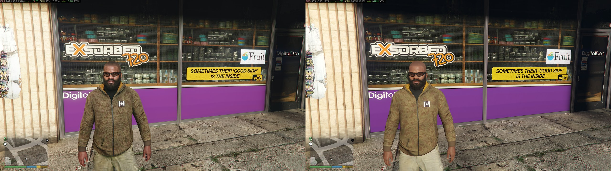
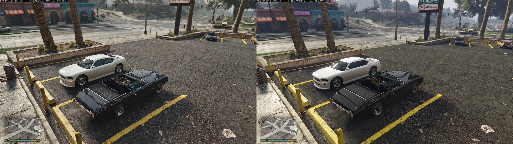
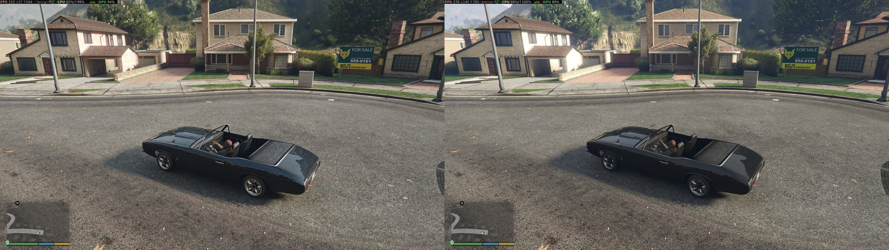

# Neural Forge

Neural Forge runs NVIDIA's DLSS 5 Neural Rendering model (the network in `nvngx_dlssnr.dll`, NGX
"Feature 18") in Linux and Proton games. A Vulkan implicit layer inside the game runs the network
itself, on the game's GPU, with [OpenDLSS-NR](https://github.com/maanHimself/OpenDLSS-NR)'s
implementation of it, and writes the model's answer back into the game's picture. Since 3.0 there is
no Windows helper, no Wine prefix and no runner: NVIDIA's DLL is needed once, to extract the model's
weights from it. It is written in Rust, with a GTK4/libadwaita settings app and a CLI. It started
as a from-scratch rebuild of [DLSS5VKLayer](https://github.com/bmitch87/DLSS5VKLayer)'s
architecture and now adapts some of its source (AGPL-3.0); [ATTRIBUTION.md](ATTRIBUTION.md) says
exactly what was taken and from where.

This is experimental, personal-use software. It runs NVIDIA's proprietary model weights outside
NVIDIA's own runtime. Read [Legal](#legal) before you use it.

Repository: [labj1987/neural-forge](https://github.com/labj1987/neural-forge).

| Model settings | Setup | Status |
|---|---|---|
|  |  |  |

The screenshots show 3.0.0 with default settings and no game running.

### In games

The same moment with the effect on (left) and off (right), toggled in game. GTA V Enhanced on 3.0.0,
2026-10-07: RTX 5070 at 2560x1440, DLSS Balanced, DLSS Frame Generation 4x, ray tracing on, the
model before the upscaler. The fps counter in the top-left corner is MangoHud, counting
frame-generated frames. Each pair was taken a few seconds apart, so the camera and traffic moved a
little.

A shop front: 201 fps shown with the effect, 305 without.



A parking lot: 192 fps shown with the effect, 233 without.



A residential street: 215 fps shown with the effect, 276 without.



## What 3.0 does

The network runs inside the game's process, in the Vulkan layer, on the game's GPU. NVIDIA's DLL is
not loaded at run time: the layer reads the model's weights from the folder `extract-model` wrote
(see [Install](#install)). The network's answer for an input frame is bit-exact with NGX's own
([docs/NATIVE_BACKEND.md](docs/NATIVE_BACKEND.md), 0.6).

The model runs in one of two places. The layer picks the place for each game by itself:

- **Before the upscaler**, when the game uses DLSS Super Resolution (at Quality, Balanced,
  Performance or DLAA). The layer recognises the frame the game hands to
  DLSS: the scene at render resolution, in HDR (16-bit float), without the HUD. It holds that DLSS
  submission, runs the network on the frame every frame, with DLSS's motion vectors and camera
  jitter for its history, and writes the answer back before DLSS upscales it. DLSS then upscales the
  enhanced frame. The model works on fewer pixels and gets the input it was made for. Games that
  record their frame in DLSS's own command buffer (Crimson Desert) are held inside that buffer.
  With DLSS Ray Reconstruction on, the model runs after the upscaler instead: Ray Reconstruction's
  input is the noisy ray-traced frame before its denoising, which is not a frame the model can
  improve. Switching Ray Reconstruction on or off in a game moves the model within a few frames.
- **After the upscaler**, for everything else: native resolution, games without DLSS, and
  devices without NVIDIA's `VK_NVX_image_view_handle`. This is the 1.x path: the finished 8-bit
  frame is captured at present, answered by the network and composited back onto the same frame
  before it is shown. It has no history (no motion vectors there).

The game's own **DLSS Frame Generation** works with the model before the upscaler. Generated
frames are built from enhanced frames, and the model runs once per real frame. NVIDIA Smooth
Motion is no longer needed or set up by the app.

`NEURAL_FORGE_PREUPSCALE=off` in the launch options switches back to the after-the-upscaler path
everywhere. Use it to compare the two, or to roll back if something looks wrong.

How it works, step by step: [docs/ARCHITECTURE.md](docs/ARCHITECTURE.md).

## Measured results

### 3.1.0, 3.0 and 2.0.10 (NVIDIA's runtime through the helper)

Same machine for all three. Machine: RTX 5070 (12 GB), NVIDIA driver 615.78.08, desktop 2560x1440 at
288 Hz with HDR on. GTA V is its built-in benchmark, pass 4 (116 s), DLSS Balanced, script mods off;
the others are one run each through the same launch, 60 s measured, settings as found (frame
generation on wherever the game has it). 3.1.0 was measured on 2026-10-08. Sources:
[docs/NATIVE_BACKEND.md](docs/NATIVE_BACKEND.md) (Phase 3, Phase 4b) and [CHANGELOG.md](CHANGELOG.md).

| Game | 3.1.0 | 3.0 | 2.0.10 |
|---|---|---|---|
| GTA V Enhanced, frame generation 4x | **50.2 real / 201.4 shown** | 49.7 real / 199.5 shown | 50.1 real / 200.4 shown |
| GTA V Enhanced, frame generation off | 71.6 fps | 71.4 fps (70.9, 71.8) | 69.7 fps (69.8, 69.8, 69.5) |
| Crimson Desert, in game (held inside DLSS's buffer, Ray Reconstruction, frame generation) | **150.9 fps** shown | 148.5 fps shown | 146.3 fps shown |
| GTA San Andreas - The Definitive Edition, in game | 87.0 frames/s held | 87.6 frames/s held | 77.1 frames/s held |
| Marvel's Spider-Man Remastered (menu) | 119.7 fps shown | 120 fps shown | 109 fps shown |
| Shadow Warrior 3 (menu) | 115.4 fps shown | 115.7 fps shown | 99.3 fps shown |
| God of War (2018), in game | 37.6 fps | 27-30 fps | 27.5 fps |

Crimson Desert since 3.1.4 (2026-10-09, one run each, same save): with Ray Reconstruction on, as in
the table, the model runs after the upscaler: 67.7 fps shown. With Ray Reconstruction off, the model
runs before the upscaler on every real frame: 29.0 real frames held per second, 173.8 fps shown.

3.1.0 did not change the frame path, and its numbers are within run-to-run spread of 3.0's (about
3 fps in GTA V), except God of War: one run, in a different spot from 3.0's, so it is not yet a
demonstrated gain. At 4K (not a configuration the test machine plays) the network is probably slower
than NVIDIA's runtime: one run with 3.0, 21.9 fps, likely VRAM-bound. The after-the-upscaler path is
about 12% slower than NVIDIA's runtime was there.

## Tested games

Each game was run with 3.1.0 on the test machine (RTX 5070, 2560x1440, Proton) with its own settings
as found: DLSS on, the game's frame generation on wherever it has it, no frame-rate cap. One run
each, 60 s measured, 2026-10-08. In every game the model ran before the upscaler on every real frame,
with no missed frames and no GPU fault. Numbers are in [Measured results](#measured-results) above;
the full record of earlier versions is in [docs/HARDWARE_VALIDATION.md](docs/HARDWARE_VALIDATION.md).

| Game | Engine, API | DLSS used | Where measured | 3.1.0 |
|---|---|---|---|---|
| GTA V Enhanced (built-in benchmark) | RAGE, DX12 | Super Resolution, Frame Generation 4x | Benchmark pass 4 | 50.2 real / 201.4 fps shown |
| Crimson Desert | BlackSpace, DX12 | Ray Reconstruction, dynamic Frame Generation | In game, held inside DLSS's buffer (since 3.1.4 after the upscaler with Ray Reconstruction on, see above) | 150.9 fps shown |
| GTA San Andreas - The Definitive Edition | Unreal Engine 4 | Super Resolution | In game | 87.0 frames/s held |
| God of War (2018) | Santa Monica Studio, DX11 | Super Resolution | In game | 37.6 fps |
| Marvel's Spider-Man Remastered | Insomniac, DX12 | Super Resolution, Frame Generation | Menu | 119.7 fps shown |
| Shadow Warrior 3: Definitive Edition | Unreal Engine 4, DX12 | Super Resolution | Menu | 115.4 fps shown |
| Lords of the Fallen (2023) | Unreal Engine 5, DX12 | Super Resolution, Frame Generation (launch option `-DLSSFG`) | In game, held inside DLSS's buffer | 56.3 real / 117.7 fps shown (without frame generation: 70.7 fps, 164.9 with NR off) |
| Remnant II | Unreal Engine 5, DX12 | Super Resolution, Frame Generation | Character select, held inside DLSS's buffer (3.1.2) | 68.7 real / 139.0 fps shown |

The two Unreal Engine 5 games ran without the GPU fault the Black Myth: Wukong Benchmark Tool showed
with 3.0 ([docs/NATIVE_BACKEND.md](docs/NATIVE_BACKEND.md), Phase 4b): Lords of the Fallen in game
with frame generation on, Remnant II at its character select screen with frame generation on. Before
3.1.2 Remnant II ran the model after the upscaler (77.8 fps shown there), because its DLSS input
alternates between two images. The network costs about 8 ms per real frame at
DLSS Balanced's 1488x836 input; in a game this light without it (Lords of the Fallen, 164.9 fps with
NR off) that is more than half the frame rate, which frame generation largely hides. Cyberpunk 2077, Resident Evil Requiem and the Wukong tool are no longer installed on the test
machine and were last tested with 2.0.8.

Setup notes for these games:

- **GTA San Andreas - The Definitive Edition** resets its Frame Rate setting to 60 at every launch,
  whatever its settings files say (a game bug). Set it to Unlocked in Options > Graphics each time.
- **Shadow Warrior 3** greys out its NVIDIA DLSS option while FidelityFX CAS is on (Settings >
  Video): set CAS to Off and DLSS becomes selectable. Its first launch also benchmarks the machine and
  picks the Low preset under Proton; set Overall Quality yourself.
- **Marvel's Spider-Man Remastered** starts with DLAA-like dynamic resolution (target 60 fps), V-Sync
  on and frame generation off: set Upscale Quality to a fixed mode, Frame Generation to DLSS Frame
  Generation and V-Sync off (Settings > Display and Graphics).
- **Crimson Desert** compiles shaders on its first launch after a Neural Forge update; the effect
  starts once it is in the world.
- **Lords of the Fallen (2023)** has no Frame Generation option in its menu: the developers turned
  DLSS Frame Generation off in patch 1.009 (October 2023), and the launch option `-DLSSFG` turns it
  back on (patch 1.1.193): `NEURAL_FORGE_ENABLE=1 %command% -DLSSFG`. While the game's settings file
  says frame generation is on (`DLSSFrameGenerationEnabled=True` in
  `AppData/Local/LOTF2/Saved/Config/Windows/GameUserSettings.ini`), VSync and Reflex are on and
  greyed out; set it to `False` with the game closed to change them, at the cost of frame generation.

## Requirements

- x86_64 Linux with glibc 2.38 or newer, the Vulkan loader, and an NVIDIA RTX 40-series or newer
  GPU (compute capability 8.9 or higher: the network's kernels use FP8 tensor-core instructions that
  RTX 20 and 30-series cards do not have) whose driver offers `VK_NV_cuda_kernel_launch`, `VK_KHR_cooperative_matrix`, `VK_NV_cooperative_matrix2` and
  `VK_EXT_shader_float8` (tested on an RTX 5070 with drivers 615.71.09 and 615.78.08). On non-NVIDIA
  GPUs the layer does nothing (a hybrid laptop's integrated GPU is left alone).
- 64-bit games. There is no 32-bit layer: a 32-bit process has no `VK_NV_cuda_kernel_launch`.
- GTK 4.12 or newer and libadwaita 1.5 or newer, from the system. The AppImage uses the host's
  GTK and libadwaita. Release builds are made on Ubuntu 24.04 (GTK 4.14, libadwaita 1.5).
- NVIDIA's own Neural Rendering DLL (`nvngx_dlssnr.dll`), once, to extract the model's weights
  from. Build 310.8.0 is the verified build: its output was compared bit for bit with NVIDIA's
  runtime. Another build that carries the same network is accepted and flagged as not verified.
  This project does not and cannot ship the DLL or the weights.
- For the model before the upscaler: a game that uses DLSS through Vulkan (under Proton, a DX12 game
  through vkd3d-proton and DXVK-NVAPI).

## Install

Download the AppImage from [Releases](https://github.com/labj1987/neural-forge/releases):

```bash
chmod +x neural-forge-*-x86_64.AppImage
```

```bash
./neural-forge-*-x86_64.AppImage
```

Each time it starts, the AppImage copies its Vulkan layer into
`~/.local/share/neural-forge`, and the layer manifest into `~/.local/share/vulkan/implicit_layer.d`,
when they differ from what is installed. Steam games launched later find the layer there. From a
source build, install the AppDir the same way:

```bash
python3 scripts/install.py install --appdir build-appimage/AppDir
```

Then extract the model from your own copy of `nvngx_dlssnr.dll` (from a game that ships it, or
NVIDIA's SDK), with the Setup tab's **Extract from DLL** button or with:

```bash
neural-forge-cli extract-model /path/to/nvngx_dlssnr.dll
```

The weights are written to `~/.local/share/neural-forge/model` (about 141 MB), with hashes the
layer checks when it loads them. The DLL is not needed after that. Restart the game afterwards.

Build 310.8.0 is the verified build. Any other build is accepted when it carries the same network
(the same tensors, each the same size), and the Setup tab and `extract-model` mark it "not verified
against NVIDIA's runtime". A DLL with a different network is refused with a report of what differs.

Nothing needs root: everything lives under `~/.config/neural-forge`, `~/.local/share/neural-forge`,
`~/.local/state/neural-forge` and `/tmp/neural-forge-$UID/`. An upstream DLSS5VKLayer install can
stay; Neural Forge does not touch its files.

## Usage

1. Open Neural Forge. On the Setup tab, check the model says "present" (or extract it there).
2. Put this in the game's Steam launch options (the Setup tab builds and copies it):

   ```text
   NEURAL_FORGE_ENABLE=1 %command%
   ```

   For a game that starts several processes, add `NEURAL_FORGE_TARGET_EXE=<game>.exe` (the
   Setup tab's "Target executable" field).
3. In the game, use DLSS Super Resolution (Quality, Balanced or Performance) to get the model
   before the upscaler. Turn on the game's own DLSS Frame Generation if you want it.
4. Start the game. The layer waits until the game has rendered steadily for 5 seconds, and stays
   out of the way on loading screens.

**HDR output (optional).** Under Proton-GE with Wine's Wayland driver:

```text
PROTON_ENABLE_WAYLAND=1 PROTON_ENABLE_HDR=1 NEURAL_FORGE_ENABLE=1 %command%
```

The game's own HDR setting must be on as well. The model before the upscaler works on DLSS's
input, so the output format does not matter to it. The after-the-upscaler path does not process
HDR (10-bit PQ or 16-bit float) swapchains: those frames are presented untouched.

**The toggle key (F11 by default)** switches the model off and on in both paths. The layer reads
the keyboard through evdev, which needs your user in the `input` group; without it, it falls back
to XInput2 raw keys on an X11/XWayland display. Under Wine's Wayland driver the game is not an X11
client, so use evdev:

```bash
sudo usermod -aG input "$USER"
```

Log out and in again afterwards. `NEURAL_FORGE_TOGGLE_KEY=F10` (a key name or a Linux key code)
changes the key, and `NEURAL_FORGE_HOTKEY_BACKEND=evdev` or `x11` forces one backend.

**Nothing to start.** The network runs in the game; the GUI is only for settings and status and can
be opened or closed at any time.

**Updating.** The layer and the GUI must come from the same version: restart the game after an
update. If the GUI says another version is running, close the game: the next game started with
this version re-creates the shared memory.

### The app's tabs

| Tab | What it has |
|---|---|
| Model | The Neural rendering switch, the model's style, intensity, local tone, local structure, skin structure, auto mask, model resolution and model every Nth frame (after the upscaler only), and the toggle key. |
| Composition | How the model's answer is blended back on the after-the-upscaler path: detail and colour strength, highlight guard, model resolution, the reversible proxy mode, transfer mode, colour trust, ratio smoothing, ghost guard, apply model edit, hold frame, and the white point. |
| Debug | Compare views (side by side or wipe, split, zoom, swap) and debug views (original/proxy, raw answer, amplified diff, colour trust). |
| Status | Telemetry (the hold's and the layer's time), layer state, **Model placement** (before the upscaler with DLSS's render size and missed frames, waiting for DLSS Super Resolution, or after the upscaler), the model, reset and profiles. |
| Setup | The model (present, or extract it from `nvngx_dlssnr.dll`) and the Steam launch option. |

The model before the upscaler runs every frame and writes the model's answer straight back
(there is no composition step), so "Model every Nth frame" and the Composition tab only change the
after-the-upscaler path. The Model tab's tuning and the switch apply to both.

Settings are live: the GUI and the running layer share them through shared memory.
`neural-forge-cli shmctl status|set|toggle|capture` does the same from a terminal.

## Known issues

- **GTA V Enhanced sometimes crashes during "Game Init".** It is an access violation at
  `GTA5_Enhanced.exe+0x12c6eb`, in the game itself, and not Neural Forge's: the test machine has
  32 crash dumps at that address, 11 of them with 1.0.1 and others from before Neural Forge
  existed. Relaunching works ([docs/HARDWARE_VALIDATION.md](docs/HARDWARE_VALIDATION.md), "2.0.0").
- **Each DLSS game needs a test run before it is claimed:** engines hand DLSS its inputs in
  different ways, and several broke an assumption the first time. See [Tested games](#tested-games).
- **The game's DLSS Frame Generation does not always switch on.** In the benchmark runs the game
  generated frames in some launches and not in others with the same settings, with or without
  Neural Forge. The fps counter shows which happened.
- **4K is probably slower than NVIDIA's runtime was** (one run, 21.9 fps in GTA V at 4K DLSS
  Balanced, likely VRAM: the network needs about 1.5 GB at that size). A network build that fails is
  retried on a schedule, and frames go to DLSS untouched meanwhile.
- **Unreal Engine 5 games are only partly tested.** Lords of the Fallen ran in game with frame
  generation, and Remnant II at its character select screen with frame generation, with no GPU fault
  in those measurements. One Remnant II launch of seven hit `Xid 32` and froze as the model started
  after the upscaler with frame generation running, on a build that did not yet hold it before the
  upscaler; the two runs since 3.1.2 holds it there had none. The cause is not known. The Black Myth: Wukong Benchmark Tool faulted the GPU
  intermittently (`Xid 13` then `Xid 32`) in the first frames with frame generation on, and its
  motion vectors cannot be copied, so the network runs there without history.
- **NVIDIA `Xid 109` (`CTX_SWITCH_TIMEOUT`) or `Xid 119` GPU hangs.** This is a widely reported
  NVIDIA Linux driver bug under Proton, also seen in games with no DLSS or neural rendering at all
  ([nvidia forums thread 283722](https://forums.developer.nvidia.com/t/xid109-ctx-switch-timeout-driver-crashes-in-many-applications/283722),
  [NVIDIA/open-gpu-kernel-modules#1097](https://github.com/NVIDIA/open-gpu-kernel-modules/issues/1097)).
  Versions before 0.1.61 had a real bug that could cause it; update first. Check `journalctl -k`
  for an `Xid` line before blaming Neural Forge.
  [docs/HARDWARE_VALIDATION.md](docs/HARDWARE_VALIDATION.md) (2026-09-16) has the diagnosis and the
  workarounds other users report.
- **Not carried over from upstream DLSS5VKLayer:** see
  [docs/UPSTREAM_PARITY.md](docs/UPSTREAM_PARITY.md).

## Environment variables

Set in a game's launch options unless the table says otherwise. Every variable was checked against
the code (`crates/`, `scripts/`).

| Variable | Read by | Effect |
|---|---|---|
| `NEURAL_FORGE_ENABLE=1` | layer (manifest) | Turns the layer on for this game. |
| `NEURAL_FORGE_DISABLE=1` | layer (manifest) | Forces it off, overriding `ENABLE`. |
| `NEURAL_FORGE_TARGET_EXE=a.exe,b.exe` | layer | Only these executables (case-insensitive basenames) may use the layer. |
| `NEURAL_FORGE_PREUPSCALE=off` | layer | Never run the model before the upscaler: the 1.x path everywhere. Unset (or `model`) is the default. An unknown value is logged and treated as `off`. |
| `NEURAL_FORGE_PREUPSCALE=dump\|identity\|roundtrip` | layer | Diagnostics: write DLSS's input to `captures/`, hold without the model (raw copy back), or run the HDR encode and decode with no model. See [docs/RUNNING_AND_MEASURING.md](docs/RUNNING_AND_MEASURING.md). |
| `NEURAL_FORGE_PREUPSCALE_PAPER_WHITE=3` | layer | The HDR encode's paper white (default 3; a positive number up to 1000). Tuning only. |
| `NEURAL_FORGE_PIPELINED=1` | layer | After the upscaler: the old pipelined present. Higher frame rate, but answers land on later frames and ghost. |
| `NEURAL_FORGE_TOGGLE_KEY=F10` | layer | Toggle key by name (`F1`-`F12`, `Home`, `N`...) or Linux key code; overrides the GUI's. |
| `NEURAL_FORGE_HOTKEY_BACKEND=evdev\|x11` | layer | Forces one keyboard backend (default: evdev, then XInput2). |
| `NEURAL_FORGE_MAX_MODEL_PIXELS=N` | layer | Largest raster the after-the-upscaler path gives the model (default 3840x2160 = 8294400). |
| `NEURAL_FORGE_LOG=/path` | layer | Log file (default: stderr). |
| `NEURAL_FORGE_LOG_TIME=1` | layer | Testing aid: timestamp every log line. |
| `NEURAL_FORGE_SHM`, `NEURAL_FORGE_UID` | all | The shared-memory file, and the uid its directory is named after. Normally left alone. |
| `NEURAL_FORGE_PROBE_NGX=1` | layer | Testing aid: log the game's DLSS work as it reaches Vulkan ([docs/PRE_UPSCALER_PROBE.md](docs/PRE_UPSCALER_PROBE.md)). |
| `NEURAL_FORGE_PROBE_PARAMS=1`, `NEURAL_FORGE_PROBE_KERNEL=<name>` | layer | Testing aids: log every word of DLSS's input-kernel parameters, or of a named kernel's. |
| `NEURAL_FORGE_LOG_LAUNCH_QUEUES=1` | layer | Testing aid: log which queue each DLSS launch is submitted on. |
| `NEURAL_FORGE_CAPTURE_AT=N:MS` | layer | Testing aid: capture the presented frame once, MS milliseconds after DLSS's frames resumed (after a gap) for the Nth time; 1 is the first frames. |
| `NEURAL_FORGE_WARMUP_SECS=N` | layer | Testing aid: seconds of steady rendering before the layer engages (default 5). |
| `NEURAL_FORGE_INLINE=off` | layer | Testing aid: never hold inside DLSS's command buffer. |
| `NEURAL_FORGE_NATIVE_CHAIN=0`, `NEURAL_FORGE_NATIVE_INLINE_CHAIN=1` | layer | Testing aids: barriers between the network's launches instead of counter chaining (before the upscaler), or counter chaining inside DLSS's buffer (where barriers are the default). |
| `NEURAL_FORGE_NATIVE_SKIP_GRAPH=1` | layer | Testing aid: record everything but the network's launches. |
| `NEURAL_FORGE_FAIL_CREATE=N[@K]`, `NEURAL_FORGE_NATIVE_FAIL=chain` | layer | Testing aids: let K network builds through, then fail the next N; or report one counter-chain timeout. |
| `NEURAL_FORGE_GUI_OPEN=<tab>` | GUI | Testing aid: open a tab (`model`, `composition`, `debug`, `status`, `setup`) at start, for screenshots. |
| `NEURAL_FORGE_BENCH=1`, `NEURAL_FORGE_REQUIRE_VULKAN=1` | layer tests | Testing aids: run the hot-path GPU benchmark; fail instead of skipping when no Vulkan device exists. |
| `NEURAL_FORGE_CLI=/path` | `scripts/install.py`, `scripts/test_install.py` | The `neural-forge-cli` to use. |


## Troubleshooting

- **No effect in game.** Check the launch option has `NEURAL_FORGE_ENABLE=1`, that the model is
  extracted (Setup tab), and give the game 5 s of normal play. The Status tab's Model placement
  line says which path is active.
- **"Waiting for DLSS Super Resolution" never changes.** The game is not using DLSS Super
  Resolution (native resolution counts as "not"), or it does not reach Vulkan through NVIDIA's NVX
  extensions. The model then runs after the upscaler. With DLAA, recognising the frame takes a few
  frames after DLSS starts, and the model then works on the full output-size frame, so it costs more
  than with DLSS Quality or Balanced.
- **Something looks wrong.** Add `NEURAL_FORGE_PREUPSCALE=off` to the launch options to compare
  with the 1.x path, and remove it again afterwards. F11 switches the model off and on in either.
- **F11 does nothing.** Add yourself to the `input` group (see [Usage](#usage)). The layer log
  (`NEURAL_FORGE_LOG`) has a `[hotkey]` line saying which backend it uses.
- **The model does not run.** The layer log (`NEURAL_FORGE_LOG=/path` in the launch options) has
  `[native]` lines saying why: no model extracted, a missing device feature, or a failed build
  (retried on its own).
- **Steam Linux Runtime (pressure-vessel).** The game must see `/tmp/neural-forge-$UID`. If it
  does not, add `PRESSURE_VESSEL_FILESYSTEMS_RW=/tmp/neural-forge-$UID` to the launch options.
- **Steam overlay problems.** The layer leaves the overlay's own small swapchain alone. If a game
  still conflicts, set `NEURAL_FORGE_TARGET_EXE` to the game's executable.
- **32-bit games** are not supported (see [Requirements](#requirements)).

### CLI

`neural-forge-cli <command>`: `init`, `status`, `doctor`, `config`, `import-binaries DIR`,
`extract-model DIR`, `install --appdir DIR`, `uninstall [--purge]`, `profile list|save|load|delete NAME`, and
`shmctl status|set NAME VALUE|toggle NAME|capture [--frames N]|reset` for the live settings.
`neural-forge-cli help` has the details.

### Files

| Path | What |
|---|---|
| `~/.config/neural-forge/config.ini` | Paths (`binaries=`, `shm=`) and every setting as `set_<name>=`. The layer applies the saved settings when it opens the channel. |
| `~/.config/neural-forge/profiles.ini` | Named profiles. |
| `~/.local/share/neural-forge/` | The installed layer and GUI, the extracted model (`model/`), an imported DLL (`binaries/`), captures (`captures/`). |
| `/tmp/neural-forge-$UID/shm.bin` | The shared memory the layer and the GUI talk through. |

### Uninstall

`neural-forge-cli uninstall` removes the files it installed (files you changed are kept).
`neural-forge-cli uninstall --purge` also removes the config, the extracted model, an imported DLL,
and `/tmp/neural-forge-$UID`.

## Building from source

```bash
bash scripts/fetch-native-tools.sh
```

```bash
cargo build --release
```

```bash
bash build-appimage.sh
```

The first fetches the pinned glslang, Vulkan-Headers and volk the native backend (`crates/native`,
the vendored OpenDLSS-NR C++) builds with. The second builds everything (protocol, layer, native,
GUI, CLI, supervisor). The third packs it into an AppImage (see `build-appimage.sh` for the package
list). Checks:

```bash
cargo test
```

```bash
python3 scripts/check_namespace.py && python3 scripts/test_install.py && bash scripts/smoke-test.sh
```

Testing on real hardware, the unattended GTA benchmark, the probes and the release checklist are
in [docs/RUNNING_AND_MEASURING.md](docs/RUNNING_AND_MEASURING.md).

## Documentation

[docs/README.md](docs/README.md) indexes every document. Start with:

- [docs/ARCHITECTURE.md](docs/ARCHITECTURE.md): the layer, the shared-memory channel and both
  frame paths, step by step.
- [docs/NATIVE_BACKEND.md](docs/NATIVE_BACKEND.md): how the network came into the layer, with the
  measurements against NVIDIA's runtime.
- [docs/LESSONS.md](docs/LESSONS.md): what was tried, what worked, what didn't, and why.
- [docs/RUNNING_AND_MEASURING.md](docs/RUNNING_AND_MEASURING.md): how to build, deploy, benchmark,
  probe and read the logs.

## Legal

Since 3.0 Neural Forge does not load or run NVIDIA's DLL, and it contains no workaround for NGX's
caller check (versions up to 2.0.10 spoofed it in their Windows helper; that code is gone).
`extract-model` reads the model's weights out of the resource data of your own copy of
`nvngx_dlssnr.dll`: no code is read, nothing is decrypted, no check is bypassed. The weights are
NVIDIA's; they are not distributed here, and running them outside NVIDIA's runtime may be restricted
by NVIDIA's NGX licence, depending on jurisdiction and how you use it. There's no licence grant
here for NVIDIA's model and none implied. Use it at your own legal risk, for personal,
non-commercial use.

Since 2026-09-17 this project directly reads and adapts source from
[DLSS5VKLayer](https://github.com/bmitch87/DLSS5VKLayer) (AGPL-3.0); see
[ATTRIBUTION.md](ATTRIBUTION.md) for what is taken and from where. Earlier versions of the
composition pipeline were clean-room (no GPL/AGPL code read or ported); that boundary no longer
holds. Upstream's license is AGPL-3.0, which is why this project's license is AGPL-3.0-or-later as
well: a requirement for the adapted code, not just a preference.

## License

This project's own code is licensed under the **GNU Affero General Public License v3.0 or later
(AGPL-3.0-or-later)**; see [LICENSE](LICENSE). It links against and depends on NVIDIA's
proprietary model weights at run time (extracted by the user from NVIDIA's DLL), which are not
covered by that license and are not redistributed here. The vendored OpenDLSS-NR sources keep their
MIT licence (`third_party/opendlss-nr/LICENSE`). Statically linked Rust crates and their licences are listed in
[THIRD_PARTY_CRATES.md](THIRD_PARTY_CRATES.md).

## Acknowledgements

- [DLSS5VKLayer](https://github.com/bmitch87/DLSS5VKLayer) (bmitch87): the architecture, the
  composition strategy and many ported functions ([ATTRIBUTION.md](ATTRIBUTION.md)).
- [OpenDLSS-NR](https://github.com/maanHimself/OpenDLSS-NR) (maan): the network implementation the
  layer runs since 3.0 (vendored in `crates/native`), and earlier the history reset rule and the
  documented proxy encode used before the upscaler.
- [OptiScaler](https://github.com/cdozdil/OptiScaler) and
  [OptiScaler_DLSSNR](https://github.com/Dagherbou/OptiScaler_DLSSNR): the idea of running the model
  before the upscaler and of reading the game's exposure (design only).
- RenoDX (clshortfuse), hhkbble and xenmods
  ([DLSSNR-Cost-Scaler](https://github.com/xenmods/DLSSNR-Cost-Scaler)): composition techniques
  carried through upstream.
- Development assistance: Claude Code (Anthropic) and Codex (OpenAI).
