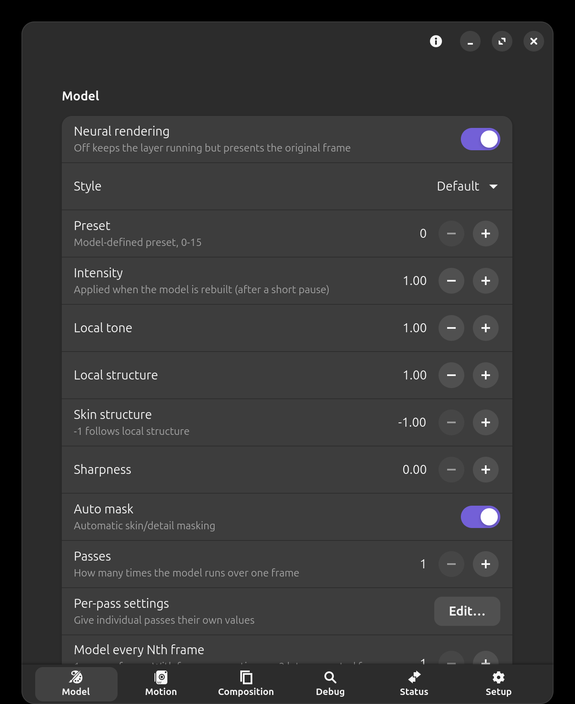
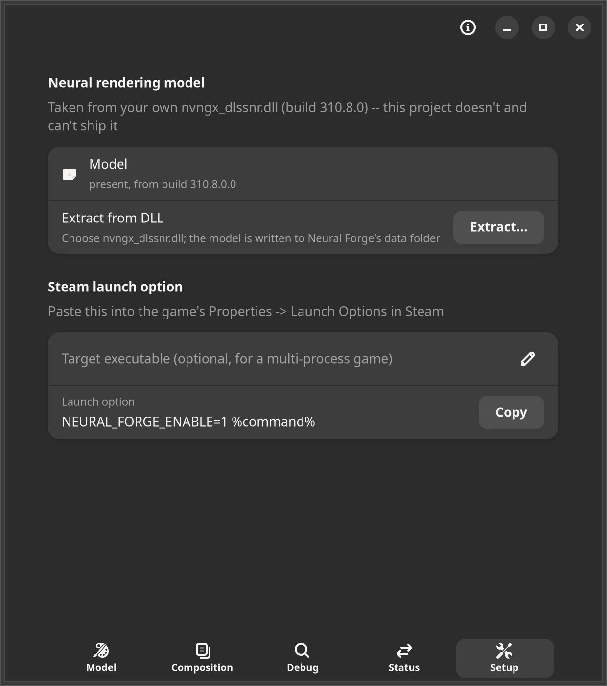
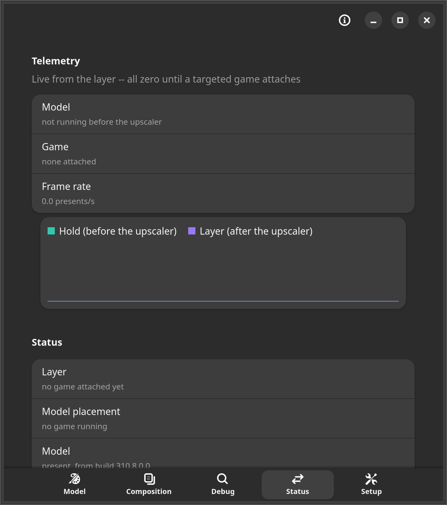

# Neural Forge

Neural Forge runs NVIDIA's DLSS 5 Neural Rendering model (`nvngx_dlssnr.dll`, NGX "Feature 18")
on Linux and Proton games. A Vulkan implicit layer inside the game hands frames to a small Windows
helper that runs NVIDIA's model under Wine or Proton, and writes the model's answer back into the
game's picture. It is written in Rust, with a GTK4/libadwaita settings app and a CLI. It is a
from-scratch rebuild of [DLSS5VKLayer](https://github.com/bmitch87/DLSS5VKLayer)'s architecture
that now adapts some of its source (AGPL-3.0); [ATTRIBUTION.md](ATTRIBUTION.md) says exactly what
was taken and from where.

This is experimental, personal-use software. It works around an authorization check in NVIDIA's
proprietary NGX DLL to run the model outside its intended integration path. Read [Legal](#legal)
before you use it.

Repository: [labj1987/neural-forge](https://github.com/labj1987/neural-forge).

| Model settings | Setup | Status |
|---|---|---|
|  |  |  |

The screenshots show 2.0.0 with default settings and no game running.

## What 2.0 does

The model runs in one of two places. The layer picks the place for each game by itself:

- **Before the upscaler**, when the game uses DLSS Super Resolution (DLSS Quality, Balanced,
  Performance, and DLAA). The layer recognises the frame the game hands to DLSS: the scene at render
  resolution, in HDR (16-bit float), without the HUD. It holds that DLSS submission, sends the
  frame to the model every frame, and writes the answer back before DLSS upscales it. DLSS then
  upscales the enhanced frame. The model works on fewer pixels and gets the input it was made for.
- **After the upscaler**, for everything else: native resolution, games without DLSS, and
  devices without NVIDIA's `VK_NVX_image_view_handle`. This is the 1.x path: the finished 8-bit
  frame is captured at present, answered by the model and composited back onto the same frame
  before it is shown.

The game's own **DLSS Frame Generation** works with the model before the upscaler. Generated
frames are built from enhanced frames, and the model runs once per real frame. NVIDIA Smooth
Motion is no longer needed or set up by the app.

`NEURAL_FORGE_PREUPSCALE=off` in the launch options switches back to the after-the-upscaler path
everywhere. Use it to compare the two, or to roll back if something looks wrong.

How it works, step by step: [docs/ARCHITECTURE.md](docs/ARCHITECTURE.md).

## Measured results

GTA V Enhanced's built-in benchmark, pass 4 (about 117 s of free roam), run unattended with
`scripts/gta-bench.sh`. Machine: RTX 5070 (12 GB), NVIDIA driver 615.71.09, desktop 2560x1440 at
288 Hz with HDR on. Game: DLSS Balanced (render resolution 1485x836 at 1440p, 2228x1253 at 4K),
script mods off, VSync off. "Real" is GTA's own frame-time file. "Shown" is MangoHud, placed below
any frame generator. Sources: [CHANGELOG.md](CHANGELOG.md) (2.0.0) and
[docs/HARDWARE_VALIDATION.md](docs/HARDWARE_VALIDATION.md) ("2.0 baseline" and "2.0.0").

| Setting | Effect off | 1.x path (after the upscaler) | 2.0 (before the upscaler) |
|---|---|---|---|
| 2560x1440 | 93.2 fps | 61.6 fps (1.0.1, model every 2nd frame) | **64.6 fps** (64.6 / 64.2 / 65.0, model every frame) |
| 3840x2160 | 81.9 fps | 28.7 fps (model every 2nd frame) | **39.0 fps** (two runs) |
| 2560x1440, DLSS Frame Generation 3x | - | 28.7 real / 86 shown | **53.0 real / 159 shown** |
| 2560x1440, DLSS Frame Generation 4x, an hour of real play, mods on | - | - | ~50 real / ~198 shown, 0 misses in steady play |

The run-to-run spread at 1440p is about 3 fps, so single-run differences of 1-2 fps are noise.
At 4K the gain is larger because the 1.x path's cost grows with the output size, and the 2.0
path's cost grows with DLSS's render size. The full record of every run is in
[docs/PRE_UPSCALER_DESIGN.md](docs/PRE_UPSCALER_DESIGN.md).

## Requirements

- x86_64 Linux, an NVIDIA GPU and driver, and the Vulkan loader. On non-NVIDIA GPUs the layer
  does nothing (a hybrid laptop's integrated GPU is left alone).
- GTK 4.12 or newer and libadwaita 1.5 or newer, from the system. The AppImage uses the host's
  GTK and libadwaita. Release builds are made on Ubuntu 24.04 (GTK 4.14, libadwaita 1.5).
- A runner for the Windows helper: a Steam compatibility tool that bundles DXVK-NVAPI
  (Proton-CachyOS, Proton-GE), or system Wine (the app installs DXVK and DXVK-NVAPI into its own
  prefix). Valve's stock Proton builds don't bundle DXVK-NVAPI, so they are not supported.
- NVIDIA's own NGX DLLs (`nvngx_dlssnr.dll`, `nvngx.dll`, `nvapi64.dll`). This project does not
  and cannot ship them.
- For the model before the upscaler: a game that uses DLSS Super Resolution through Vulkan
  (under Proton, a DX12 game through vkd3d-proton and DXVK-NVAPI). Only GTA V Enhanced has been
  measured.

## Install

Download the AppImage from [Releases](https://github.com/labj1987/neural-forge/releases):

```bash
chmod +x neural-forge-*-x86_64.AppImage
```

```bash
./neural-forge-*-x86_64.AppImage
```

Each time it starts, the AppImage copies its Vulkan layer and helper into
`~/.local/share/neural-forge`, and the layer manifest into `~/.local/share/vulkan/implicit_layer.d`,
when they differ from what is installed. Steam games launched later find the layer there. From a
source build, install the AppDir the same way:

```bash
python3 scripts/install.py install --appdir build-appimage/AppDir
```

Then import the NGX DLLs from your own NVIDIA driver or SDK files, from the Setup tab's
**Import...** button or with:

```bash
neural-forge-cli import-binaries /path/to/dlls
```

Files are copied into `~/.local/share/neural-forge/binaries`. Restart the helper afterwards.

Nothing needs root: everything lives under `~/.config/neural-forge`, `~/.local/share/neural-forge`,
`~/.local/state/neural-forge` and `/tmp/neural-forge-$UID/`. An upstream DLSS5VKLayer install can
stay; Neural Forge does not touch its files.

## Usage

1. Open Neural Forge. On the Setup tab, check the three DLLs say "present" and pick a runner.
2. Put this in the game's Steam launch options (the Setup tab builds and copies it):

   ```text
   NEURAL_FORGE_ENABLE=1 %command%
   ```

   For a game that starts several processes, add `NEURAL_FORGE_TARGET_EXE=<game>.exe` (the
   Setup tab's "Target executable" field).
3. In the game, use DLSS Super Resolution (Quality, Balanced or Performance) to get the model
   before the upscaler. Turn on the game's own DLSS Frame Generation if you want it.
4. Start the game. The layer waits until the game has rendered steadily for 5 seconds, and stays
   out of the way on loading screens.

**HDR output (optional).** Under Proton-GE with Wine's Wayland driver:

```text
PROTON_ENABLE_WAYLAND=1 PROTON_ENABLE_HDR=1 NEURAL_FORGE_ENABLE=1 %command%
```

The game's own HDR setting must be on as well. The model before the upscaler works on DLSS's
input, so the output format does not matter to it. The after-the-upscaler path does not process
HDR (10-bit PQ or 16-bit float) swapchains: those frames are presented untouched.

**The toggle key (F11 by default)** switches the model off and on in both paths. The layer reads
the keyboard through evdev, which needs your user in the `input` group; without it, it falls back
to XInput2 raw keys on an X11/XWayland display. Under Wine's Wayland driver the game is not an X11
client, so use evdev:

```bash
sudo usermod -aG input "$USER"
```

Log out and in again afterwards. `NEURAL_FORGE_TOGGLE_KEY=F10` (a key name or a Linux key code)
changes the key, and `NEURAL_FORGE_HOTKEY_BACKEND=evdev` or `x11` forces one backend.

**The helper.** When neural rendering is on, opening the GUI starts the helper if it isn't
running. Closing the GUI stops only a helper that this window started; one started with
`neural-forge-cli start` keeps running. The helper can be started before or after the game, and
restarted while it runs. Stop it with the Status tab's **Stop** button or `neural-forge-cli stop`.

**Updating.** The layer, the helper and the GUI must come from the same version: restart the
helper and the game together after an update. If the helper refuses to start because of an old
shared-memory version, remove `/tmp/neural-forge-$UID/shm.bin` while nothing has it open.

### The app's tabs

| Tab | What it has |
|---|---|
| Model | The Neural rendering switch, the model's style, preset, intensity, local tone, local structure, skin structure, sharpness, auto mask, passes (with per-pass settings), model every Nth frame, rebuild spacing and the toggle key. |
| Motion | Estimated motion vectors (on by default; optical flow in the helper), their units and quality. |
| Composition | How the model's answer is blended back on the after-the-upscaler path: detail and colour strength, highlight guard, model resolution, the reversible proxy mode, transfer mode, colour trust, ratio smoothing, ghost guard, apply model edit, hold frame, and the white point. |
| Debug | Compare views (side by side or wipe, split, zoom, swap) and debug views (original/proxy, raw answer, amplified diff, colour trust). |
| Status | Telemetry, helper and layer state, **Model placement** (before the upscaler with DLSS's render size and missed frames, waiting for DLSS Super Resolution, paused, or after the upscaler), NGX binaries, reset and profiles. |
| Setup | NGX binaries and import, the runner, and the Steam launch option. |

The model before the upscaler runs every frame and writes the model's answer straight back
(there is no composition step), so "Model every Nth frame" and the Composition tab only change the
after-the-upscaler path. The Model tab's tuning and the switch apply to both.

Settings are live: the GUI and the running layer share them through shared memory.
`neural-forge-cli shmctl status|set|toggle|capture` does the same from a terminal.

## Known issues

- **GTA V Enhanced sometimes crashes during "Game Init".** It is an access violation at
  `GTA5_Enhanced.exe+0x12c6eb`, in the game itself, and not Neural Forge's: the test machine has
  32 crash dumps at that address, 11 of them with 1.0.1 and others from before Neural Forge
  existed. Relaunching works ([docs/HARDWARE_VALIDATION.md](docs/HARDWARE_VALIDATION.md), "2.0.0").
- **Only GTA V Enhanced has been probed and measured** for the model before the upscaler. Other
  DLSS games should look the same to the layer, but each needs a probe run before that is claimed.
- **The game's DLSS Frame Generation does not always switch on.** In the benchmark runs the game
  generated frames in some launches and not in others with the same settings, with or without
  Neural Forge. The fps counter shows which happened.
- **4K with a frame generator runs close to the VRAM limit** of a 12 GB RTX 5070 (11.86 GB peak
  in the 4K runs with Smooth Motion). A model build that fails there is retried on a schedule,
  and frames go to DLSS untouched meanwhile; the Status tab says "paused".
- **NVIDIA `Xid 109` (`CTX_SWITCH_TIMEOUT`) or `Xid 119` GPU hangs.** This is a widely reported
  NVIDIA Linux driver bug under Proton, also seen in games with no DLSS or neural rendering at all
  ([nvidia forums thread 283722](https://forums.developer.nvidia.com/t/xid109-ctx-switch-timeout-driver-crashes-in-many-applications/283722),
  [NVIDIA/open-gpu-kernel-modules#1097](https://github.com/NVIDIA/open-gpu-kernel-modules/issues/1097)).
  Versions before 0.1.61 had a real bug that could cause it; update first. Check `journalctl -k`
  for an `Xid` line before blaming Neural Forge.
  [docs/HARDWARE_VALIDATION.md](docs/HARDWARE_VALIDATION.md) (2026-09-16) has the diagnosis and the
  workarounds other users report.
- **Not carried over from upstream DLSS5VKLayer:** see
  [docs/UPSTREAM_PARITY.md](docs/UPSTREAM_PARITY.md).

## Environment variables

Set in a game's launch options unless the table says otherwise. Every variable was checked against
the code (`crates/`, `scripts/`).

| Variable | Read by | Effect |
|---|---|---|
| `NEURAL_FORGE_ENABLE=1` | layer (manifest) | Turns the layer on for this game. |
| `NEURAL_FORGE_DISABLE=1` | layer (manifest) | Forces it off, overriding `ENABLE`. |
| `NEURAL_FORGE_TARGET_EXE=a.exe,b.exe` | layer | Only these executables (case-insensitive basenames) may use the layer. |
| `NEURAL_FORGE_PREUPSCALE=off` | layer | Never run the model before the upscaler: the 1.x path everywhere. Unset (or `model`) is the default. An unknown value is logged and treated as `off`. |
| `NEURAL_FORGE_PREUPSCALE=dump\|identity\|roundtrip` | layer | Diagnostics: write DLSS's input to `captures/`, hold without the model (raw copy back), or run the HDR encode and decode with no model. See [docs/RUNNING_AND_MEASURING.md](docs/RUNNING_AND_MEASURING.md). |
| `NEURAL_FORGE_PREUPSCALE_PAPER_WHITE=3` | layer | The HDR encode's paper white (default 3; a positive number up to 1000). Tuning only. |
| `NEURAL_FORGE_PIPELINED=1` | layer | After the upscaler: the old pipelined present. Higher frame rate, but answers land on later frames and ghost. |
| `NEURAL_FORGE_TOGGLE_KEY=F10` | layer | Toggle key by name (`F1`-`F12`, `Home`, `N`...) or Linux key code; overrides the GUI's. |
| `NEURAL_FORGE_HOTKEY_BACKEND=evdev\|x11` | layer | Forces one keyboard backend (default: evdev, then XInput2). |
| `NEURAL_FORGE_MAX_MODEL_PIXELS=N` | layer | Largest raster the after-the-upscaler path gives the model (default 3840x2160 = 8294400). |
| `NEURAL_FORGE_LOG=/path` | layer, helper | Log file (default: stderr for the layer). The supervisor sets it for the helper. |
| `NEURAL_FORGE_SHM`, `NEURAL_FORGE_UID` | all | The shared-memory file, and the uid its directory is named after. Normally left alone. |
| `NEURAL_FORGE_INSTALL_DIR` | supervisor (GUI, CLI) | Where to find the helper (default: the installed copy, then the AppImage's). |
| `NEURAL_FORGE_AUTO_DOWNLOAD=0` | supervisor | System-Wine runner: never download DXVK or DXVK-NVAPI (put them in the binaries folder). |
| `NEURAL_FORGE_BIN_DIR`, `NEURAL_FORGE_SKIP_NVAPI` | helper | Set by the supervisor: the binaries folder as a `Z:` path, and (Proton) do not load the vendored `nvapi64.dll`. |
| `NEURAL_FORGE_PROBE_NGX=1` | layer | Testing aid: log the game's DLSS work as it reaches Vulkan ([docs/PRE_UPSCALER_PROBE.md](docs/PRE_UPSCALER_PROBE.md)). |
| `NEURAL_FORGE_WARMUP_SECS=N` | layer | Testing aid: seconds of steady rendering before the layer engages (default 5). |
| `NEURAL_FORGE_HDR_FLAGS=hdr\|sdr\|autoexp0` | helper | Testing aid: the NGX creation flags for an RGBA16F frame. They make no measurable difference. |
| `NEURAL_FORGE_FAIL_CREATE=N[@K]` | helper | Testing aid: let K model builds through, then fail the next N, to exercise the recovery. |
| `NEURAL_FORGE_HELPER_DELAY_MS=N` | helper | Testing aid: delay every answer by N ms. |
| `NEURAL_FORGE_GUI_OPEN=<tab>\|passes` | GUI | Testing aid: open a tab (`model`, `motion`, `composition`, `debug`, `status`, `setup`) or the per-pass dialog at start, for screenshots. |
| `NEURAL_FORGE_BENCH=1`, `NEURAL_FORGE_REQUIRE_VULKAN=1` | layer tests | Testing aids: run the hot-path GPU benchmark; fail instead of skipping when no Vulkan device exists. |
| `NEURAL_FORGE_CLI=/path` | `scripts/install.py`, `scripts/test_install.py` | The `neural-forge-cli` to use. |

`NEURAL_FORGE_DMABUF` is no longer read by anything; an old launch option that still carries it
is harmless.

## Troubleshooting

- **No effect in game.** Check the launch option has `NEURAL_FORGE_ENABLE=1`, that the helper is
  running (Status tab), and give the game 5 s of normal play. The Status tab's Model placement
  line says which path is active.
- **"Waiting for DLSS Super Resolution" never changes.** The game is not using DLSS Super
  Resolution (native resolution counts as "not"), or it does not reach Vulkan through NVIDIA's NVX
  extensions. The model then runs after the upscaler. With DLAA, recognising the frame takes a few
  frames after DLSS starts, and the model then works on the full output-size frame, so it costs more
  than with DLSS Quality or Balanced.
- **"Paused".** The helper has no model right now (a failed build, often VRAM). Frames go to
  DLSS untouched until it rebuilds; the helper log says why.
- **Something looks wrong.** Add `NEURAL_FORGE_PREUPSCALE=off` to the launch options to compare
  with the 1.x path, and remove it again afterwards. F11 switches the model off and on in either.
- **F11 does nothing.** Add yourself to the `input` group (see [Usage](#usage)). The layer log
  (`NEURAL_FORGE_LOG`) has a `[hotkey]` line saying which backend it uses.
- **The helper reports the model failed.** Open the helper log
  (`~/.local/state/neural-forge/helper.log`, or the Status tab's log button). The helper retries
  on its own; `neural-forge-cli restart` starts it fresh.
- **Steam Linux Runtime (pressure-vessel).** The game must see `/tmp/neural-forge-$UID`. If it
  does not, add `PRESSURE_VESSEL_FILESYSTEMS_RW=/tmp/neural-forge-$UID` to the launch options.
- **Steam overlay problems.** The layer leaves the overlay's own small swapchain alone. If a game
  still conflicts, set `NEURAL_FORGE_TARGET_EXE` to the game's executable.
- **32-bit games.** A separate 32-bit layer ships (`VK_LAYER_neuralforge_neural_32`, same
  `NEURAL_FORGE_ENABLE=1`). It handles frames up to 3840x2160 at 8 bits and passes larger ones
  through.

### CLI

`neural-forge-cli <command>`: `init`, `setup`, `start`, `stop`, `restart`, `status`, `doctor`,
`config`, `runners`, `detect-gpu`, `import-binaries DIR`, `install --appdir DIR`,
`uninstall [--purge]`, `profile list|save|load|delete NAME`, and
`shmctl status|set NAME VALUE|toggle NAME|capture [--frames N]|reset` for the live settings.
`neural-forge-cli help` has the details.

### Files

| Path | What |
|---|---|
| `~/.config/neural-forge/config.ini` | Runner, paths, and every setting as `set_<name>=` (per-pass overrides as `set_pass_<n>_<field>=`). |
| `~/.config/neural-forge/profiles.ini` | Named profiles. |
| `~/.local/share/neural-forge/` | Installed layer and helper, imported NGX DLLs (`binaries/`), the managed Wine prefix (`prefix/`), captures (`captures/`). |
| `~/.local/state/neural-forge/helper.log` | Helper log. Moved to `helper.log.1` when it passes 20 MB at a helper start. |
| `/tmp/neural-forge-$UID/shm.bin` | The shared memory the layer, helper and GUI talk through. |

Runners are found in `~/.local/share/Steam/compatibilitytools.d`, the Flatpak and Snap Steam
equivalents, `$XDG_DATA_DIRS/steam/compatibilitytools.d` and `/usr/share/steam/compatibilitytools.d`
(user copies first), with system Wine as the fallback.

### Uninstall

`neural-forge-cli uninstall` removes the files it installed (files you changed are kept).
`neural-forge-cli uninstall --purge` also removes the config, the imported DLLs, the managed
prefix, the logs and `/tmp/neural-forge-$UID`.

## Building from source

```bash
cargo build --release
```

```bash
cargo +stable build --release --target x86_64-pc-windows-gnu -p neural-forge-helper
```

```bash
CARGO_HELPER='cargo +stable' bash build-appimage.sh
```

The first builds the native crates (protocol, layer, GUI, CLI, supervisor); don't use
`--workspace`, the helper targets Windows only. The second cross-compiles the helper and needs
`mingw-w64` and the `x86_64-pc-windows-gnu` target. The third packs everything into an AppImage
(see `build-appimage.sh` for the package list). Checks:

```bash
cargo test
```

```bash
python3 scripts/check_namespace.py && python3 scripts/test_install.py && bash scripts/smoke-test.sh
```

Testing on real hardware, the unattended GTA benchmark, the probes and the release checklist are
in [docs/RUNNING_AND_MEASURING.md](docs/RUNNING_AND_MEASURING.md).

## Documentation

[docs/README.md](docs/README.md) indexes every document. Start with:

- [docs/ARCHITECTURE.md](docs/ARCHITECTURE.md): the processes, the shared-memory protocol and
  both frame paths, step by step, with timings.
- [docs/LESSONS.md](docs/LESSONS.md): what was tried, what worked, what didn't, and why.
- [docs/RUNNING_AND_MEASURING.md](docs/RUNNING_AND_MEASURING.md): how to build, deploy, benchmark,
  probe and read the logs.

## Legal

`nvngx_dlssnr.dll` checks which module is calling into it and refuses to run outside its intended
host application. The helper here spoofs that check (an import-table hook on the caller-identity
query, `GetModuleFileNameW`) so the model will initialize at all under a generic Vulkan helper
process. That is a deliberate design choice, not an accident, and it likely falls under DMCA §1201
(circumventing an access control) and/or breaches NVIDIA's NGX EULA, depending on jurisdiction and
how you use it. There's no license grant here for that mechanism and none implied. Use it at your
own legal risk, for personal, non-commercial use.

Since 2026-09-17 this project directly reads and adapts source from
[DLSS5VKLayer](https://github.com/bmitch87/DLSS5VKLayer) (AGPL-3.0); see
[ATTRIBUTION.md](ATTRIBUTION.md) for what is taken and from where. Earlier versions of the
composition pipeline were clean-room (no GPL/AGPL code read or ported); that boundary no longer
holds. Upstream's license is AGPL-3.0, which is why this project's license is AGPL-3.0-or-later as
well: a requirement for the adapted code, not just a preference.

## License

This project's own code is licensed under the **GNU Affero General Public License v3.0 or later
(AGPL-3.0-or-later)**; see [LICENSE](LICENSE). It links against and depends on NVIDIA's
proprietary NGX SDK/DLLs at run time, which are not covered by that license and are not
redistributed here. Statically linked Rust crates and their licences are listed in
[THIRD_PARTY_CRATES.md](THIRD_PARTY_CRATES.md).

## Acknowledgements

- [DLSS5VKLayer](https://github.com/bmitch87/DLSS5VKLayer) (bmitch87): the architecture, the
  composition strategy and many ported functions ([ATTRIBUTION.md](ATTRIBUTION.md)).
- [OpenDLSS-NR](https://github.com/maanHimself/OpenDLSS-NR) (maan): the history reset rule and the
  documented proxy encode used before the upscaler (design only).
- [OptiScaler](https://github.com/cdozdil/OptiScaler) and
  [OptiScaler_DLSSNR](https://github.com/Dagherbou/OptiScaler_DLSSNR): the idea of running the model
  before the upscaler and of reading the game's exposure (design only).
- RenoDX (clshortfuse), hhkbble and xenmods
  ([DLSSNR-Cost-Scaler](https://github.com/xenmods/DLSSNR-Cost-Scaler)): composition techniques
  carried through upstream.
- Development assistance: Claude Code (Anthropic) and Codex (OpenAI).
