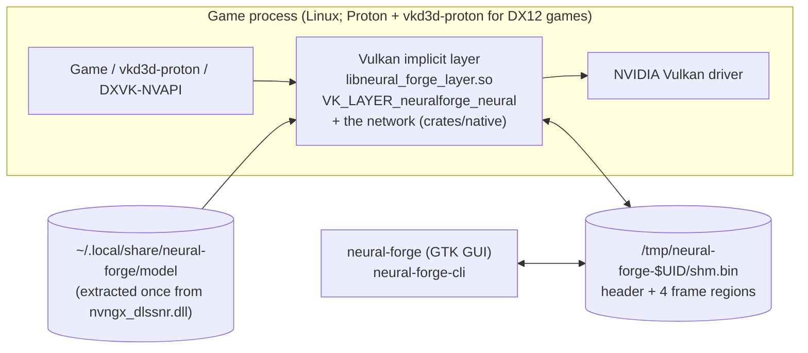
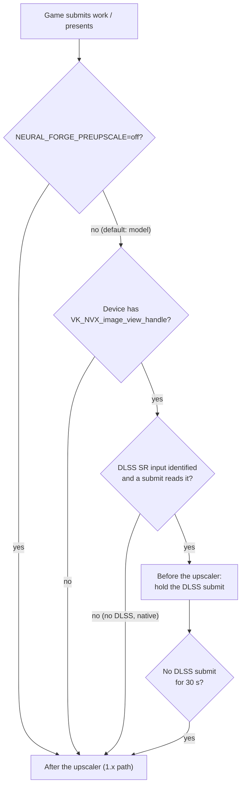
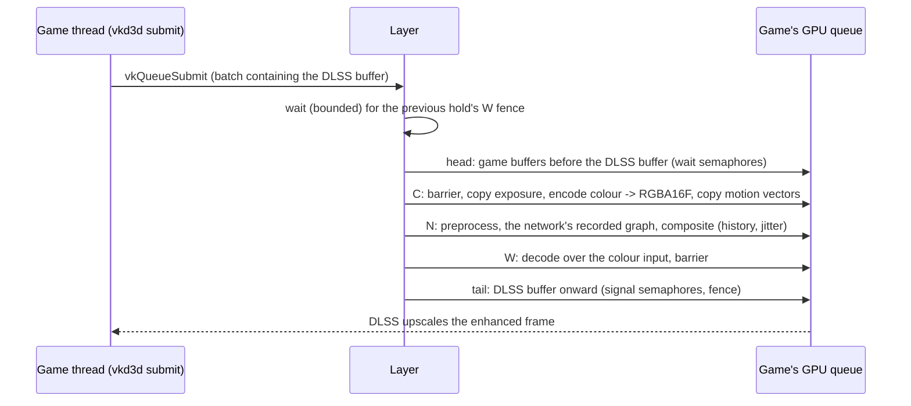

# How Neural Forge works

This document follows a frame through Neural Forge 3.0, from the game's Vulkan calls to the picture
on screen. It covers the layer, the shared-memory channel, the two frame paths, the network the layer
runs, and what each stage costs. Every timing names the run it comes from.

Code paths are relative to the repository root. Measurements come from one machine (RTX 5070,
NVIDIA 615.71.09 or 615.78.08, GTA V Enhanced, DLSS Balanced, 2560x1440 unless noted, script mods
off); see [RUNNING_AND_MEASURING.md](RUNNING_AND_MEASURING.md) for how they were taken. Up to 2.0.10
the model ran in a separate Windows helper under Wine, through NVIDIA's NGX runtime; timings from that
time say so. How the network moved into the layer, and what it costs against NGX, is
[NATIVE_BACKEND.md](NATIVE_BACKEND.md).

## 1. The processes



| Part | Crate | What it does |
|---|---|---|
| Vulkan layer, inside the game | `crates/layer` | Hooks device creation, command recording, `vkQueueSubmit` and `vkQueuePresentKHR`. Holds DLSS's input and runs the network on it before the upscaler; after the upscaler, captures frames, answers them with the network on a thread of its own (`preupscale/native_post.rs`) and composites the answer back. x86_64 only. |
| Network | `crates/native` | OpenDLSS-NR's implementation of the DLSS 5 Neural Rendering network (vendored C++, GLSL and PTX kernels, `third_party/opendlss-nr`), built into the layer: loads the extracted weights, records the network's graph, runs it on the game's device. |
| GUI | `crates/gui` | GTK4/libadwaita settings app. Reads and writes live settings in shared memory, shows status, extracts the model. |
| CLI | `crates/cli` | `neural-forge-cli`: install, model extraction, `doctor`, profiles, and `shmctl` for live settings. |
| Supervisor | `crates/supervisor` | Library shared by GUI and CLI: paths, config, the channel's path, the model's extraction, installs the layer. |
| Protocol | `crates/protocol` | The shared-memory contract: header layout, regions, version, paths, saved settings, environment variable access. |

**One process.** NVIDIA ships the DLSS 5 Neural Rendering model only inside a Windows DLL
(`nvngx_dlssnr.dll`), and no Linux build of NGX's Feature 18 exists
([NATIVE_NGX_HELPER_DESIGN.md](NATIVE_NGX_HELPER_DESIGN.md)). Up to 2.0.10 the model therefore ran in
a Windows helper under Wine, with its own Vulkan device, and frames crossed through shared memory.
Since 3.0 the layer runs an open implementation of the same network (OpenDLSS-NR) on the weights
`extract-model` reads out of the DLL's resources. For the same input frame its answer is bit-exact
with NGX's ([NATIVE_BACKEND.md](NATIVE_BACKEND.md), 0.6). No NVIDIA code runs.

**Who loads the layer.** The layer is an implicit Vulkan layer. Its manifest
(`data/neural_forge_layer.json`) enables it only when `NEURAL_FORGE_ENABLE=1` is in the
environment, so only games with that launch option load it. Inside the game it stays inert on
non-NVIDIA devices, on a second copy of itself, and in excluded processes (launchers, Wine
desktop, overlays, or anything not named in `NEURAL_FORGE_TARGET_EXE`). The first eligible
process takes a kernel file lease on `shm.bin.owner`; others cannot attach.

## 2. Shared memory

One file, `/tmp/neural-forge-$UID/shm.bin`, mapped by the layer and the GUI (or CLI). It is under
`/tmp` because Steam's pressure-vessel container bind-mounts `/tmp` from the host. It carries the
live settings and status both ways, and the after-the-upscaler path's frames between the layer's
present hook and its model server thread. Layout (`crates/protocol/src/lib.rs`):

| Offset | Size | Content |
|---|---|---|
| 0 | 64 KiB (`HEADER_BYTES`) | `ShmHeader` (664 bytes used) |
| 64 KiB | `MAX_FRAME` | slot 0 proxy: the frame the layer captured |
| + `MAX_FRAME` | `MAX_FRAME` | slot 0 answer: the model's output |
| + 2 `MAX_FRAME` | `MAX_FRAME` | slot 1 proxy |
| + 3 `MAX_FRAME` | `MAX_FRAME` | slot 1 answer |

`MAX_FRAME` is 7680 x 4320 x 8 bytes (an 8K frame at 8 bytes per pixel). The file is sparse; only
touched pages use memory. The before-the-upscaler path does not use the frame regions at all: its
frames never leave the GPU.

### The header

`ShmHeader` is `#[repr(C)]` and made only of `AtomicU32` fields (`crates/protocol/src/header.rs`).
Offsets are pinned by compile-time asserts; any change bumps `SHM_VERSION`. Groups:

- **Identity:** `magic` (`NFR1`), `version` (`SHM_VERSION`).
- **Handshake, slot 0:** `seq_req`, `seq_resp`, `width`, `height`, `proxy_format`, `seq_ok`,
  `answered_w`/`answered_h` (the size the model server answered, so an answer for another
  swapchain or an old size is refused), `seq_eval` (v11).
- **Handshake, slot 1 (v3):** `seq_req_b`, `seq_resp_b`, `width_b`, `height_b`, `proxy_format_b`.
- **Liveness:** `server_heartbeat`, `layer_heartbeat`, `quit`.
- **Change counters:** `control_seq` (any setting changed), `tuning_seq` (a model setting changed).
- **Model settings:** `enabled`, `style`, `auto_mask`, intensity, local tone, local structure,
  skin structure, `model_interval` (v6).
- **Composition settings (after-the-upscaler path):** transfer and colour strength, max ratio,
  transfer mode, white point fields, `working_scale`, compare and debug views, `reversible_mode`,
  `apply_model`, `hold_frame`, `ghost_guard` (v4), colour trust and ratio smoothing (v5).
  `composition_bypass` stays in the header (append-only) but nothing reads it.
- **Model server status:** `server_state`, `model_up`, frame counter, upload/eval/readback ms,
  `server_busy_us` (v10).
- **Layer status:** attached, frame counter, size, format, `layer_ms`, measured white, GPU
  capture/compose ms (v8), `layer_reason` (the native network's status line), `game_name`.
- **Pre-upscaler status (v9):** `preupscale_state` (0 off, 1 waiting for DLSS input, 2 holding),
  `preupscale_width`/`height`, `preupscale_hold_ms`, `preupscale_misses`, `native_running` (v13).
- **Reserved, read by nothing:** `format`, `hdr_encode`, `hdr_mode`/`hdr_detected`/`hdr_active`.

### The handshake (after the upscaler)

The layer writes the proxy bytes (or has the GPU write them into the imported region), stores
`width`, `height` and `proxy_format`, then bumps `seq_req`. The model server
(`preupscale::native_post::PostServer`, a thread in the game's process) sees `seq_req` change, runs
the network on the frame, writes the answer region, stores `answered_w/h`, `server_busy_us`, and
`seq_eval` if the network actually ran, then stores `seq_resp = seq_req`. The layer polls
`seq_resp`. If the network is not ready (loading, building for a new size, in use by the pre-upscaler
hold), the server copies the proxy into the answer region and does not update `seq_eval`: an
**echo**.

The GUI and CLI refuse a header of another `version` instead of re-initialising it, and say which
versions disagree. The layer applies the saved settings (`config.ini`) when it creates the header.

### Protocol versions

| Version | Change | Shipped in |
|---|---|---|
| 1 | First layout | 0.1.0 |
| 2 | BGRA8 kept apart from RGBA8, a layer-side motion region | 0.1.31 (2026-09-11) |
| 3 | Second independent request/response slot ([PROTOCOL_V3_DESIGN.md](PROTOCOL_V3_DESIGN.md)) | 0.1.59 |
| 4 | `ghost_guard` | 0.1.78 |
| 5 | Colour trust, ratio smoothing | 0.1.80 |
| 6 | `model_interval` | 0.1.83 |
| 7 | Layer-side motion region and its fields removed (motion moved into the helper) | 0.1.93 |
| 8 | Layer GPU timestamps | 1.1.0 |
| 9 | Pre-upscaler status fields | 2.0.0 |
| 10 | `helper_busy_us` | 2.0.0 |
| 11 | `seq_eval` (model answer vs echo) | 2.0.0 |
| 12 | `preset` and `sharpness` removed (the 310.8 model never reads them) | 3.0.0 |
| 13 | `native_running` (the layer runs the model itself) | 3.0.0 |
| 14 | `scaling_downscaler` removed (nothing read it) | 3.0.0 |
| 15 | The helper's fields removed (passes, motion, rebuild spacing, VRAM and feature counts, its reason string, the DMA-BUF exchange); `helper_*` renamed `server_*` | 3.0.0 |

Sources: `SHM_VERSION`'s doc comment, CHANGELOG.md, git log. Versions 9-11 all landed during
the 2.0 work; 2.0.0 ships 11, 3.0.0 ships 15.

## 3. Which path a frame takes



The mode is read once per process from the environment (`preupscale::mode`). With `off`, the
hooked-command list, the resolved entry points and every hot path are exactly 1.1.0's; tests
(`lib.rs::probe_command_tests`) and the smoke test's `off` pass guard that. A device without NVX
never gets the tracking either.

Once a device has held a DLSS submit, the after-the-upscaler compose stays off for that device
until no DLSS submit has been seen for 30 s (`preupscale::HAND_BACK`). Loading screens, where
DLSS does not run, are presented untouched instead of switching paths (see
[LESSONS.md](LESSONS.md), "The stuck NGX feature").

## 4. Before the upscaler (2.0)

`crates/layer/src/preupscale.rs`, `crates/layer/src/preupscale/hdr.rs`,
`crates/layer/shaders/preupscale_{encode,decode,exposure}.comp`. The full design record, with every
experiment, is [PRE_UPSCALER_DESIGN.md](PRE_UPSCALER_DESIGN.md).

### 4.1 What DLSS looks like from a Vulkan layer

Under Proton, a DX12 game's DLSS goes through vkd3d-proton and DXVK-NVAPI and reaches Vulkan as
CUDA kernels: `vkCmdCuLaunchKernelNVX`, on image views registered with
`vkGetImageViewHandleNVX` / `vkGetImageViewHandle64NVX` / `vkGetImageViewAddressNVX`. The probe
([PRE_UPSCALER_PROBE.md](PRE_UPSCALER_PROBE.md)) found, in GTA V Enhanced:

- DLSS's inputs are registered once and stay stable: colour (render size, `R16G16B16A16_SFLOAT`,
  storage, scene-linear HDR), depth (`D32_SFLOAT_S8_UINT`), motion vectors (`R16G16_SFLOAT`), and
  a 1x1 `R16_SFLOAT` exposure value.
- One DLSS evaluation per frame: 14 launches in one command buffer, in one submit on the
  present queue, about 5 submits before the present.
- In 9006 of 9006 launch-bearing command buffers, nothing touches the colour input before the
  first launch, and it is in `GENERAL` layout. So it is final when that submit starts, and the
  layer can work **at the submit**, without touching the game's command buffers.

### 4.2 Tracking (always on, in model mode, on NVX devices)

- `vkCreateImage` / `vkCreateImageView`: the layer records extent, format and usage.
- The NVX registration calls: the layer records every registered view and the handle or address
  it got back.
- `vkCreateCuFunctionNVX` / `vkDestroyCuFunctionNVX`: the layer records each kernel's name and
  what it is (`preupscale::Kernel`: DLSS SR's input kernel, Ray Reconstruction's network, other).
- `vkCmdCuLaunchKernelNVX`: marks the command buffer as launch-bearing (also through
  `vkCmdExecuteCommands`), with which kernels it launches. When the launch's parameters use CUDA's
  "extra" buffer form (what vkd3d-proton uses), the layer reads that parameter buffer (never writes
  it; at most 4 KiB) and notes which registered handles appear among its 8-byte words.
- Image barriers on the watched images, committed in submission order, so the layer knows their
  layout at a submit.

On a device with NVX but no DLSS, the per-command-buffer and per-submit hooks cost one atomic
read.

### 4.3 Identification

At a launch-bearing submit (`Tracker::observe`, then `Tracker::refresh`), two rules, the first
winning (PRE_UPSCALER_DESIGN.md, "Identification by the input kernel's parameters (DLAA)"), behind
one precondition:

- **DLSS Super Resolution must be running** (PRE_UPSCALER_DESIGN.md, "DLSS Ray Reconstruction").
  Once any kernel name is known, nothing is identified unless SR's input kernel
  (`hiluma_engine_input*`, `cuda_engine_input_kernel*`) launched within the last 64 launch-bearing
  submits; only a launch of that kernel is parameter evidence; and a buffer that launches no SR
  input kernel is never the hold point. This keeps DLSS Ray Reconstruction (Resident Evil Requiem
  with ray tracing: its input is the noisy ray-traced frame) and frame generation alone out of
  both rules. It is logged once: `DLSS Ray Reconstruction detected (... launched, no DLSS Super
  Resolution input kernel)`. Without kernel names the rules work as before.

- **By the input kernel's parameters** (`Rule::Params`). A command buffer's first launch that names a
  registered depth image and a 2-channel float image is read as DLSS SR's input kernel. If it names
  exactly one depth image and exactly one `RGBA16F`/`R11G11B10` storage image at the depth's extent,
  that image is the colour input, with that depth and those motion vectors. It need not be smaller
  than the output, so DLAA is found. The extent condition keeps DLSS Frame Generation out, because
  FG's launch names its output-size frame beside the render-size depth. An output-size candidate
  (DLAA, or FG at native resolution) counts if its buffer also names the 1x1 `R16_SFLOAT`
  exposure image, which SR takes and FG does not; without one (a game that gives DLSS no exposure)
  only with SR's own shape: a later launch of the same buffer names it with another output-size
  image (SR's output kernel), no other launch-bearing buffer names it, and it is the only such
  entry. The decision waits for 16 launch-bearing submits
  without new evidence, so both SR's and FG's buffers have been seen. Ambiguity (two candidates in
  one launch, or different colour inputs from different buffers that the exposure does not settle)
  is logged once, and the size rule decides. One exception (3.1.2): when the size rule finds
  nothing, and every such entry's buffer names the same exposure image and the inputs share one
  extent, they are one evaluation alternating its input (Remnant II, whose motion vectors are 3
  pixels narrower than its colour input); the lowest handle is chosen and each submit is held with
  the input its buffer names. Only an `RGBA16F` colour input is held.
- **By size** (`Rule::Size`, `preupscale::identify`), the fallback: the registered `RGBA16F` storage image (2D, single sample) whose extent equals
  a registered depth image's (any depth format: `D32_SFLOAT`, `D32_SFLOAT_S8_UINT`,
  `D24_UNORM_S8_UINT`, ...) and a registered motion-vector image's (`RG16F`, else `RG32F`), and is
  smaller than the output. The output is the device's largest swapchain; on a device with no
  swapchain (DLSS on another device than the one that presents, or views registered before the
  swapchain exists) it is the largest registered `RGBA16F`/`R11G11B10` storage image. "Smaller" is
  what rules out DLAA. Several candidates: the lowest handle is the colour input; the others are
  only logged, and a forwarded buffer that names one of them is counted (PRE_UPSCALER_DESIGN.md,
  "Several colour candidates (2.0.1)").
- The identification line ends with `identified by the input kernel's parameters (...)` or
  `identified by size`. When both rules pick the same images (GTA V, Crimson Desert), the switch
  from size to parameters is no re-identification: nothing is skipped and the hold target stays.
- **Exposure input:** the 1x1 `R16_SFLOAT` image the input kernel's buffer names, else the
  registered one (not for an output-size input whose buffer names none).
- Without a readable exposure input the exposure is measured from the frame (4.6).
- With DLAA the model works on the full output-size frame every frame (as costly as the 1.x path on
  every frame). The hold, encode and decode do not depend on the size.
- When nothing qualifies, the line says why: the output used, the first failed condition for every
  `RGBA16F` storage extent, and the registered views grouped by extent, format and usage (at most
  1500 bytes, for the first 16 changes of the set per device).
- While any device of the process holds, the post-upscaler compose stays off on every device
  (`preupscale::post_off_by_any_device`), so a game whose DLSS runs on a device without the
  swapchain does not get the model twice.

The submit on which the inputs are (re)identified is not held: their layouts are not known yet.
The next one is.

### 4.4 Which submits are held (frame generation)

DLSS Frame Generation also runs as CUDA kernels, in two more command buffers per real frame on
another queue. Each launch-bearing buffer is classified (`LaunchRefs::kind`):

| Kind | Rule | Action |
|---|---|---|
| Colour | a launch's parameters name the identified colour input | held (the split point) |
| Foreign | every launch readable, naming registered views, never the colour input; or, once kernel names are known, no launch of SR's input kernel | forwarded untouched (DLSS FG's, Ray Reconstruction's, other NGX features') |
| Unknown | an unreadable launch, parameters naming no registered view, or a launch before identification | held, as before the fix (only with inputs identified) |

Before this rule, the layer held FG's submits too and ran the model three times per real frame,
twice on the wrong input: 22.4 real / 67.1 shown fps. After it: 53.0 / 159
(PRE_UPSCALER_DESIGN.md, "DLSS Frame Generation").

### 4.5 The hold, step by step



1. **Split the submit** (`plan`, `submit_around`). The call is re-issued through the next layer as:
   the batches before the DLSS batch, plus the DLSS batch's buffers before the DLSS buffer with the
   batch's wait semaphores; the layer's batches `C`, `N` and `W` (`C` carrying those wait semaphores
   when the DLSS buffer was first, stage masks widened to `ALL_COMMANDS`); then the DLSS buffer onward
   with the batch's signal semaphores, the later batches, and the application's fence. Nothing is
   injected into a game command buffer. The module comment of `preupscale.rs` has the
   dependency-chain argument; each of `C`, `N`, `W` opens with a barrier from
   `ALL_COMMANDS/MEMORY_WRITE` to what it reads.
2. **Capture and encode** (`C`): copy the exposure texel into a small buffer (or, with no readable
   exposure image, measure it from the colour input: the auto-exposure, 4.6); the encode compute
   shader reads the colour input through a storage view and writes the layer's padded `RGBA16F`
   image; DLSS's motion vectors are copied beside it for the history. An odd width or height is
   padded by repeating the last column or row.
3. **The network** (`N`, `preupscale/native.rs`): `native_preprocess.comp` builds the network's input
   lanes from the encoded frame, the previous answer reprojected with the motion vectors and the
   camera jitter (read from DLSS's input-kernel parameters), and the Model tab's settings; the graph
   recorded for this extent runs the network; `native_composite.comp` applies the style operator and
   intensity and keeps the answer as the next frame's history. The history is reset after a frame
   that went to DLSS untouched, after 500 ms without a frame, on another extent, or after a frame
   whose exposure was unusable.
4. **Write back and decode** (`W`): the decode shader inverts the encode and writes the colour input
   in place, cropping the padding, keeping the original value where the encoded input was clamped
   and keeping the original alpha; a closing barrier makes it visible to DLSS.
5. **Forward the tail.** DLSS runs on the enhanced input.

There is no CPU wait inside the hold: the only wait is the next hold's bounded wait for this hold's
`W` fence, which covers `C` and `N` too (same queue, submitted before it). One network frame is in
flight at a time.

**Inside DLSS's command buffer** (`preupscale/inline.rs`). Some games record their frame and DLSS
in one command buffer (Crimson Desert), so there is no submit to split. There the layer records into
DLSS's buffer, at the input kernel's launch, a copy of the colour input (and the motion vectors) to
a staging image and a wait on an event; at the submit its worker thread runs the same `C`/`N`/`W` on
the layer's own compute queue, then sets the event, and DLSS continues on the enhanced input. The
network's launches there are separated by barriers instead of counter chaining (chaining faulted the
GPU in Black Myth: Wukong; NATIVE_BACKEND.md, Phase 4b).

### 4.6 The HDR encode and decode

The model treats its input as a display-referred picture in [0, 1] and clamps its output there,
whatever NGX's `Hdr`/`SDR`/`AutoExposure` flags say (E1b found them to make no difference). So
the layer encodes DLSS's scene-linear input before sending it, and inverts that on the answer
(`preupscale/hdr.rs`):

```
e     = the game's 1x1 R16_SFLOAT exposure value (read on the GPU every frame),
        else measured from the frame (auto-exposure, below)
v     = max(scene, 0) * e / W                     W = paper white, default 3
y     = v                                          v <= 0.75
        0.75 + 0.25 * (1 - exp(-5.770780 * (v - 0.75)))   above, per channel
input = sRGB_OETF(y),  alpha = 1
```

```
y      = min(sRGB_EOTF(answer), 1 - 1e-4)
v      = y                                         y < 0.75
         0.75 - ln(1 - (y - 0.75) / 0.25) / 5.770780        above
scene' = v * W / e     (original kept where the encoded input was >= 0.999; alpha kept)
```

The shoulder and sRGB step follow OpenDLSS-NR's documented proxy; the exposure multiply, the
paper white of 3 and the inverse are this project's, chosen by measurement (PRE_UPSCALER_DESIGN.md,
"E1b"). Precision on lavapipe: the round trip is within about 2.6e-3 relative where the encoded
value is at most 0.9.

**Auto-exposure** (`shaders/preupscale_exposure.comp`, `hdr::AutoExposure`; PRE_UPSCALER_DESIGN.md,
"Auto-exposure when the game gives DLSS none (RE Requiem)"). When DLSS's inputs have no readable
1x1 exposure image, the capture measures `e` from the colour input before the encode: a 256-bin
histogram of log2 Rec.709 luma over every other pixel in each direction (NaN/Inf skipped, black
skipped), the trimmed (1% each end) mean log2 luma, `target = log2(0.6) - mean`, and 5% per frame
towards the target in log2 space, kept in a small host-visible state buffer (reset when the
identification changes). The result is written as a half into the same exposure buffer the game's
texel would be copied into, so the encode and the decode of a hold use the very same `e`. The key
0.6 is calibrated on GTA V's own exposure (within -21% / +27% of it on both E1b dumps). The source
is logged once per identification: `[preupscale] exposure: the game's 1x1 R16F` or `[preupscale]
exposure: measured from the frame (auto)`, and the 300-hold summary ends with `exposure median=...
(auto|game)`.

### 4.7 Failures and the hand-back

- **The network not ready** (still loading, building for a new extent, a failed build, no model
  extracted, a device without the network's features): the hold forwards the DLSS submit untouched
  and counts a miss; the Status tab's placement line ends with the layer's status line ("native
  network running" or "... not running: <why>"). Failed builds are retried after 0.5, 1 and 2 s, the
  4th attempt closes and reopens the network, then every 30 s (`neural_forge_protocol::rebuild`).
- **Counter-chain timeout:** the graph is rebuilt with barriers and the history reset.
- **Hand-back.** Once a device has held, the after-the-upscaler path stays off on it until no DLSS
  submit has been seen for 30 s (`HAND_BACK`), so loading screens are presented untouched.

### 4.8 Timings, 1440p Balanced (render 1485x836, padded 1486x836)

From NATIVE_BACKEND.md (1.4, Phase 3):

| Stage | ms |
|---|---|
| Hold, CPU time the DLSS submit is held | 0.08 |
| `N` on the GPU (preprocess, network, composite), median per 300 holds | 6.46-6.66 |
| the network alone on the idle GPU | 5.50 |
| `W` on the GPU | 0.11-0.12 |

At 4K Balanced (render 2228x1253) the network alone takes 10.7 ms on the idle GPU and 18.8-19.5 ms in
game (likely VRAM-bound). For comparison, 2.0's hold through the helper held the submit for about
10.2 ms of CPU time (3.6-4.4 ms of it draining the game's queue, 5.9-6.1 ms the helper's round
trip; PRE_UPSCALER_DESIGN.md, "Hand-off latency").

## 5. After the upscaler (1.x path)

`crates/layer/src/capture.rs` (`run`), `crates/layer/src/composition/`,
`crates/layer/shaders/encode.comp`, `compose.comp`. This path runs for every game and frame that
is not held before the upscaler.

### 5.1 Admission and engagement

- **Swapchain admission** (`surface_usage.rs`, `swapchain.rs`): the layer adds `TRANSFER_SRC` and
  `TRANSFER_DST` usage to the game's swapchain when the surface supports them, after checking the
  create info's extension chain and flags. Swapchains it cannot admit stay pass-through. Only
  8-bit SDR formats (`B8G8R8A8`/`R8G8B8A8`, UNORM or sRGB) are processed; HDR and float16
  swapchains are presented untouched.
- **Primary swapchain:** one per process (the largest plausible game size), so overlays are left
  alone.
- **Warm-up** (`swapchain::Warmup`): the layer engages only after 5 s of steady presents and
  steps back out on loading screens. Composing during GTA V's loading screens used to freeze it.

### 5.2 Capture

- **Direct, zero-copy capture** (default when available): the game's swapchain image is copied on
  the GPU into a device-local image and into slot 0's proxy region, which the layer has imported
  as Vulkan memory with `VK_EXT_external_memory_host`. The layer adds that extension at
  `vkCreateDevice` when the game did not request it ([EXTERNAL_MEMORY_HOST_DESIGN.md](EXTERNAL_MEMORY_HOST_DESIGN.md)).
  The model server imports the same regions on its side. The `[sync]` log line says `zc=true`.
- **Copy path:** when the import is not possible, or the model works below the frame's size
  (`working_scale` < 1), the layer blits into a smaller scratch image, encodes it
  (`encode.comp`: the white-point divide and the soft knee), reads it back into host-cached
  memory and copies it into shared memory.
- **Model size:** at most 3840x2160 pixels (`NEURAL_FORGE_MAX_MODEL_PIXELS`), always even;
  larger frames are scaled down for the model and the answer scaled back up.

### 5.3 The synchronous present

The default since 0.1.78. On frame N's present:

1. Capture frame N and send it (`seq_req`).
2. Wait for frame N's answer, bounded by 250 ms (`SYNC_BUDGET`) and the server's heartbeat. A
   missing or late answer means frame N is presented untouched; the late request is never
   waited on again.
3. Compose answer N onto frame N with `compose.comp` (GPU), then present.

An answer is never applied to a later frame, which is what removed the ghosting
([LESSONS.md](LESSONS.md), "Ghosting"). The application's present wait semaphores are relayed
through a wait-only batch ahead of the layer's work, and the real present waits on the layer's
semaphore.

**Model every Nth frame** (`model_interval`, default 1): on the presents between model runs, the
last answer is composed onto the current frame without waiting. Used before 2.0 to stop
frame-generated frames from each waiting for an answer.

`NEURAL_FORGE_PIPELINED=1` restores the old pipelined present (never waits, applies answers to
later frames, ghosts).

### 5.4 Composition

`compose.comp` blends the model's answer into the frame. The default path compares the model's
answer with the frame encoded the same way the model saw it, takes a luminance ratio (relighting)
from a neighbourhood, bounds the colour change (colour trust), trusts the model's hue only where
it reported light, and limits the ratio (highlight guard). Transfer modes decide how a smaller
model answer is brought back (classic, matched residual, native + edit). Most of this is ported
from upstream's `dlssnr.hlsl` ([ATTRIBUTION.md](../ATTRIBUTION.md)); `composition/color.rs` is the
one clean-room file. The composition invariants every change must keep are in
[AGENTS.md](../AGENTS.md), "Composition invariants".

### 5.5 The model server

`preupscale/native_post.rs`. A thread the layer starts on an NVIDIA device that has the network.
Per slot, a new `seq_req` with an 8-bit frame runs through `native_post_preprocess.comp` (the
network's input lanes from the RGBA8/BGRA8 proxy), the network (its graph recorded a second time, for
the layer's compute queue family) and `native_post_composite.comp` (the residual, style operator and
intensity, 8 bits out in the proxy's channel order), on a compute queue of the layer's own, waited
for (bounded). There are no motion vectors after the upscaler, so every frame is a first frame, with
a fixed seed. The pre-upscaler hold and the server never use the network at once: each refuses for a
second after the other used it (`Loader::claim_pre`, `claim_post`).

### 5.6 Timings

In the `pan` reproducer (2492x1370 window, no DLSS) the answer takes 15.7 ms, against 11.1 ms through
2.x's helper (NGX's evaluate 10.8 ms): NVIDIA's network is about 20% faster than OpenDLSS-NR's at the
same size on this GPU; 67-68 fps with every frame composited against 75-79 (NATIVE_BACKEND.md, 2.1).

## 6. The network

`crates/native` (the vendored OpenDLSS-NR C++, `cpp/nf_native.cpp` glue, kernels built and embedded
by `build.rs`), `crates/layer/src/preupscale/native.rs` (the loader, the per-device state, the hold).

- **Device setup** (`create_device`): on an NVIDIA device with the pre-upscaler path on, the layer
  checks the network's requirements and adds `VK_NV_cuda_kernel_launch`,
  `VK_KHR_cooperative_matrix`, `VK_NV_cooperative_matrix2`, `VK_EXT_shader_float8` and their
  features to the game's device, and a queue in a compute family without graphics. A device that
  lacks one is created exactly as the game asked and the log names what was missing.
- **Loading**, lazily on the first hold (or the first post-path request): the model directory (hash
  checked, 0.53-0.66 s), the weights' device copies, the kernels, a first run so the driver compiles
  the PTX, and the graph's recording for the frame's extent (0.73-1.15 s at 1485x836), on a loader
  thread and the layer's compute queue, never the game's graphics queue (a graphics-family queue
  faulted the game's channel).
- **Every frame** runs on the game's queue inside its DLSS submit (4.5), or on the layer's compute
  queue (inside DLSS's buffer, and the model server).
- The network's Vulkan calls go through the next layer's entry points, so they never pass through
  this layer.

## 7. Settings, status and the GUI

The GUI and CLI write settings straight into the header and bump `control_seq` (and `tuning_seq`
for model settings). The layer reads them live; the native hold applies a change at the next frame.
Saved settings live in `~/.config/neural-forge/config.ini` as `set_<name>=` and are applied by the
layer when it creates the header. Status comes from heartbeats and counters, refreshed once a
second; the Status tab's "Model placement" line is `preupscale_state` with the extent, misses and
the layer's status line.

## 8. Failure behaviour

Everything fails open: a missing model, a network that will not build, a late answer, an
unsupported swapchain, a submit the layer cannot split, or a Vulkan error means the frame goes on
untouched. Every fence wait the layer can hit is bounded (5 s, `FENCE_WAIT_TIMEOUT`); a timeout is
logged once with a breadcrumb trail (`crates/layer/src/breadcrumbs.rs`). `VK_ERROR_DEVICE_LOST`
latches the layer off.
