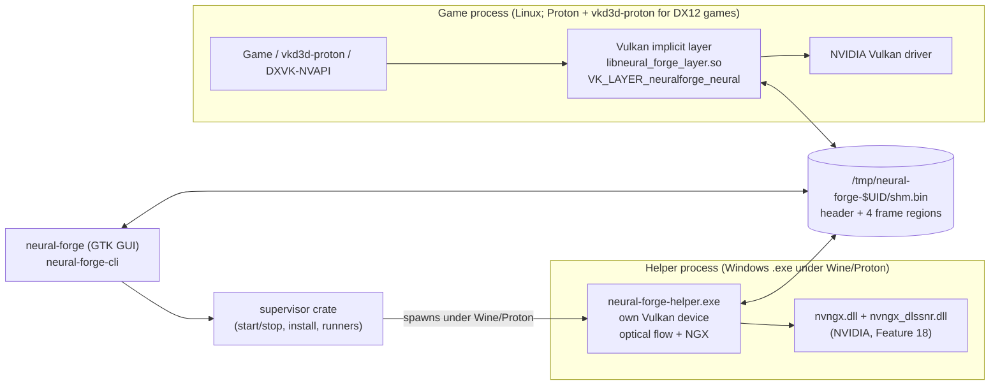
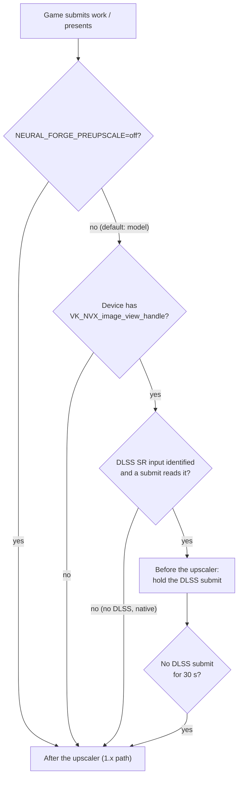
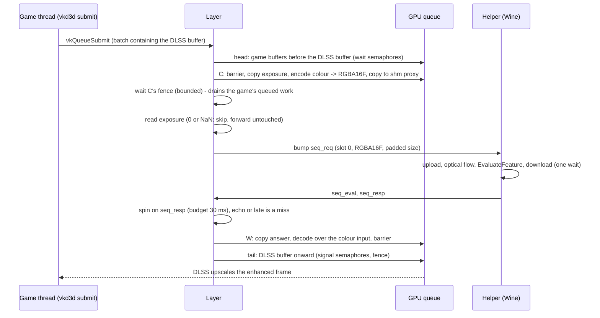
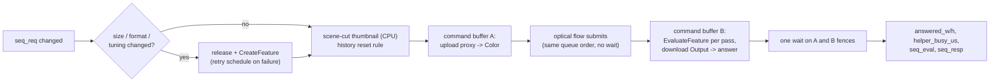

# How Neural Forge works

This document follows a frame through Neural Forge 2.0.0, from the game's Vulkan calls to the
picture on screen. It covers the processes, the shared-memory protocol, the two frame paths, the
helper's work per request, and what each stage costs. Every timing names the run it comes from.

Code paths are relative to the repository root. Measurements come from one machine (RTX 5070,
NVIDIA 615.71.09, GTA V Enhanced, DLSS Balanced, 2560x1440 unless noted, script mods off); see
[RUNNING_AND_MEASURING.md](RUNNING_AND_MEASURING.md) for how they were taken.

## 1. The processes



| Process | Crate | What it does |
|---|---|---|
| Vulkan layer, inside the game | `crates/layer` | Hooks device creation, command recording, `vkQueueSubmit` and `vkQueuePresentKHR`. Captures frames, waits for answers, writes them back. Built native (64- and 32-bit). |
| Helper | `crates/helper` | A Windows executable (`x86_64-pc-windows-gnu`) run under Wine or Proton. Loads NVIDIA's NGX DLLs, owns its own Vulkan device, estimates motion with `VK_NV_optical_flow`, and runs `EvaluateFeature`. |
| GUI | `crates/gui` | GTK4/libadwaita settings app. Reads and writes live settings in shared memory, shows status, starts the helper. |
| CLI | `crates/cli` | `neural-forge-cli`: start/stop, install, import DLLs, `doctor`, profiles, and `shmctl` for live settings. |
| Supervisor | `crates/supervisor` | Library shared by GUI and CLI: finds runners (Proton builds, system Wine), prepares the Wine prefix (DXVK and DXVK-NVAPI for system Wine), spawns and stops the helper under a lock, installs the layer. |
| Protocol | `crates/protocol` | The shared-memory contract: header layout, regions, version, paths, environment variable access. |

**Why two processes.** NVIDIA ships the DLSS 5 Neural Rendering model only as a Windows DLL
(`nvngx_dlssnr.dll`). A native Linux NGX runtime exists, but no Linux build of Feature 18 does
([NATIVE_NGX_HELPER_DESIGN.md](NATIVE_NGX_HELPER_DESIGN.md)). So the model runs in a Windows
process under Wine, with its own Vulkan device, and the frames cross through shared memory.

**Caller identity.** `nvngx_dlssnr.dll` and `nvngx.dll` check which module calls them with
`GetModuleFileNameW`. The helper patches its own import-table slot for that function so the DLLs
see `nvngx.dll` (`crates/helper/src/spoof.rs`; README, "Legal"). NGX's own `AllocateParameters`
fails with `0xbad00002` in this environment, so the helper uses its own implementation of the
`NVSDK_NGX_Parameter` object (`crates/helper/src/selfparam.rs`). Every NGX call runs inside a
fault guard (`crates/helper/src/guard.rs`).

**Who loads the layer.** The layer is an implicit Vulkan layer. Its manifest
(`data/neural_forge_layer.json`) enables it only when `NEURAL_FORGE_ENABLE=1` is in the
environment, so only games with that launch option load it. Inside the game it stays inert on
non-NVIDIA devices, on a second copy of itself, and in excluded processes (launchers, Wine
desktop, overlays, or anything not named in `NEURAL_FORGE_TARGET_EXE`). The first eligible
process takes a kernel file lease on `shm.bin.owner`; others cannot attach.

## 2. Shared memory

One file, `/tmp/neural-forge-$UID/shm.bin`, mapped by all three sides. It is under `/tmp`
because Steam's pressure-vessel container bind-mounts `/tmp` from the host, and a Wine prefix
reaches it as `Z:\tmp\...`. Layout (`crates/protocol/src/lib.rs`):

| Offset | Size | Content |
|---|---|---|
| 0 | 64 KiB (`HEADER_BYTES`) | `ShmHeader` (2024 bytes used) |
| 64 KiB | `MAX_FRAME` | slot 0 proxy: the frame the layer sends |
| + `MAX_FRAME` | `MAX_FRAME` | slot 0 answer: the model's output |
| + 2 `MAX_FRAME` | `MAX_FRAME` | slot 1 proxy |
| + 3 `MAX_FRAME` | `MAX_FRAME` | slot 1 answer |

`MAX_FRAME` is 7680 x 4320 x 8 bytes (an 8K frame at 8 bytes per pixel). The file is sparse; only
touched pages use memory. The 32-bit layer maps each region separately and is capped at a 4K
8-bit frame.

### The header

`ShmHeader` is `#[repr(C)]` and made only of `AtomicU32` fields (`crates/protocol/src/header.rs`),
so the Linux layer and the Windows helper agree on the layout without sharing a toolchain. Fields
are only ever appended; offsets are pinned by compile-time asserts. Groups:

- **Identity:** `magic` (`NFR1`), `version` (`SHM_VERSION`).
- **Handshake, slot 0:** `seq_req`, `seq_resp`, `width`, `height`, `proxy_format`, `seq_ok`,
  `answered_w`/`answered_h` (the size the helper answered, so an answer for another swapchain or
  an old size is refused), `seq_eval` (v11).
- **Handshake, slot 1 (v3):** `seq_req_b`, `seq_resp_b`, `width_b`, `height_b`, `proxy_format_b`.
- **Liveness:** `heartbeat` (helper), `layer_heartbeat`, `quit`.
- **Change counters:** `control_seq` (any setting changed), `tuning_seq` (a setting the model
  latches at feature creation changed; the helper rebuilds on it).
- **Model settings:** `enabled`, `passes`, `preset`, `style`, `auto_mask`, intensity, local tone,
  local structure, skin structure, sharpness, `model_interval` (v6), `rebuild_settle_ms`, the
  per-pass array (`pass[30]`).
- **Composition settings (after-the-upscaler path):** transfer and colour strength, max ratio,
  transfer mode, white point fields, `working_scale`, compare and debug views, `reversible_mode`,
  `apply_model`, `hold_frame`, `ghost_guard` (v4), colour trust and ratio smoothing (v5),
  `composition_bypass`.
- **Motion:** `mvec_enabled`, `mvec_scale_mode`, `mvec_quality`.
- **Helper status:** `helper_state`, `model_up`, frame counter, upload/eval/readback ms, VRAM,
  feature count, `helper_busy_us` (v10), `helper_reason` (text).
- **Layer status:** attached, frame counter, size, format, `layer_ms`, measured white, GPU
  capture/compose ms (v8), `layer_reason`, `game_name`.
- **Pre-upscaler status (v9):** `preupscale_state` (0 off, 1 waiting for DLSS input, 2 holding,
  3 paused), `preupscale_width`/`height`, `preupscale_hold_ms`, `preupscale_misses`.
- **Reserved, read by neither the layer nor the helper:** the DMA-BUF exchange fields (`proxy_pid`, `proxy_fd`, ...), `format`,
  `hdr_encode`, `hdr_mode`/`hdr_detected`/`hdr_active` (the GUI shows `hdr_mode` as unavailable). The DMA-BUF transport turned out to be
  impossible ([DMABUF_TRANSPORT_DESIGN.md](DMABUF_TRANSPORT_DESIGN.md)).

### The handshake

The layer writes the proxy bytes (or has the GPU write them into the imported region), stores
`width`, `height` and `proxy_format`, then bumps `seq_req`. The helper sees `seq_req` change,
processes the frame, writes the answer region, stores `answered_w/h`, `helper_busy_us`, and
`seq_eval` if the model actually ran, then stores `seq_resp = seq_req`. The layer polls
`seq_resp`. If the helper had no model (not built yet, a failed evaluate), it copies the proxy
into the answer region and does not update `seq_eval`: an **echo**. The pre-upscaler path never
writes an echo back.

A helper and layer that disagree on `version` refuse each other's header instead of
re-initialising it; the GUI and CLI say which versions disagree.

### Protocol versions

| Version | Change | Shipped in |
|---|---|---|
| 1 | First layout | 0.1.0 |
| 2 | BGRA8 kept apart from RGBA8, a layer-side motion region | 0.1.31 (2026-09-11) |
| 3 | Second independent request/response slot ([PROTOCOL_V3_DESIGN.md](PROTOCOL_V3_DESIGN.md)) | 0.1.59 |
| 4 | `ghost_guard` | 0.1.78 |
| 5 | Colour trust, ratio smoothing | 0.1.80 |
| 6 | `model_interval` | 0.1.83 |
| 7 | Layer-side motion region and its fields removed (motion moved into the helper) | 0.1.93 |
| 8 | Layer GPU timestamps | 1.1.0 |
| 9 | Pre-upscaler status fields | 2.0.0 |
| 10 | `helper_busy_us` | 2.0.0 |
| 11 | `seq_eval` (model answer vs echo) | 2.0.0 |

Sources: `SHM_VERSION`'s doc comment, CHANGELOG.md, git log. Versions 9-11 all landed during
the 2.0 work; 2.0.0 ships 11.

## 3. Which path a frame takes



The mode is read once per process from the environment (`preupscale::mode`). With `off`, the
hooked-command list, the resolved entry points and every hot path are exactly 1.1.0's; tests
(`lib.rs::probe_command_tests`) and the smoke test's `off` pass guard that. A device without NVX
never gets the tracking either.

Once a device has held a DLSS submit, the after-the-upscaler compose stays off for that device
until no DLSS submit has been seen for 30 s (`preupscale::HAND_BACK`). Loading screens, where
DLSS does not run, are presented untouched instead of switching paths (see
[LESSONS.md](LESSONS.md), "The stuck NGX feature").

## 4. Before the upscaler (2.0)

`crates/layer/src/preupscale.rs`, `crates/layer/src/preupscale/hdr.rs`,
`crates/layer/shaders/preupscale_{encode,decode,exposure}.comp`. The full design record, with every
experiment, is [PRE_UPSCALER_DESIGN.md](PRE_UPSCALER_DESIGN.md).

### 4.1 What DLSS looks like from a Vulkan layer

Under Proton, a DX12 game's DLSS goes through vkd3d-proton and DXVK-NVAPI and reaches Vulkan as
CUDA kernels: `vkCmdCuLaunchKernelNVX`, on image views registered with
`vkGetImageViewHandleNVX` / `vkGetImageViewHandle64NVX` / `vkGetImageViewAddressNVX`. The probe
([PRE_UPSCALER_PROBE.md](PRE_UPSCALER_PROBE.md)) found, in GTA V Enhanced:

- DLSS's inputs are registered once and stay stable: colour (render size, `R16G16B16A16_SFLOAT`,
  storage, scene-linear HDR), depth (`D32_SFLOAT_S8_UINT`), motion vectors (`R16G16_SFLOAT`), and
  a 1x1 `R16_SFLOAT` exposure value.
- One DLSS evaluation per frame: 14 launches in one command buffer, in one submit on the
  present queue, about 5 submits before the present.
- In 9006 of 9006 launch-bearing command buffers, nothing touches the colour input before the
  first launch, and it is in `GENERAL` layout. So it is final when that submit starts, and the
  layer can work **at the submit**, without touching the game's command buffers.

### 4.2 Tracking (always on, in model mode, on NVX devices)

- `vkCreateImage` / `vkCreateImageView`: the layer records extent, format and usage.
- The NVX registration calls: the layer records every registered view and the handle or address
  it got back.
- `vkCreateCuFunctionNVX` / `vkDestroyCuFunctionNVX`: the layer records each kernel's name and
  what it is (`preupscale::Kernel`: DLSS SR's input kernel, Ray Reconstruction's network, other).
- `vkCmdCuLaunchKernelNVX`: marks the command buffer as launch-bearing (also through
  `vkCmdExecuteCommands`), with which kernels it launches. When the launch's parameters use CUDA's
  "extra" buffer form (what vkd3d-proton uses), the layer reads that parameter buffer (never writes
  it; at most 4 KiB) and notes which registered handles appear among its 8-byte words.
- Image barriers on the watched images, committed in submission order, so the layer knows their
  layout at a submit.

On a device with NVX but no DLSS, the per-command-buffer and per-submit hooks cost one atomic
read.

### 4.3 Identification

At a launch-bearing submit (`Tracker::observe`, then `Tracker::refresh`), two rules, the first
winning (PRE_UPSCALER_DESIGN.md, "Identification by the input kernel's parameters (DLAA)"), behind
one precondition:

- **DLSS Super Resolution must be running** (PRE_UPSCALER_DESIGN.md, "DLSS Ray Reconstruction").
  Once any kernel name is known, nothing is identified unless SR's input kernel
  (`hiluma_engine_input*`, `cuda_engine_input_kernel*`) launched within the last 64 launch-bearing
  submits; only a launch of that kernel is parameter evidence; and a buffer that launches no SR
  input kernel is never the hold point. This keeps DLSS Ray Reconstruction (Resident Evil Requiem
  with ray tracing: its input is the noisy ray-traced frame) and frame generation alone out of
  both rules. It is logged once: `DLSS Ray Reconstruction detected (... launched, no DLSS Super
  Resolution input kernel)`. Without kernel names the rules work as before.

- **By the input kernel's parameters** (`Rule::Params`). A command buffer's first launch that names a
  registered depth image and a 2-channel float image is read as DLSS SR's input kernel. If it names
  exactly one depth image and exactly one `RGBA16F`/`R11G11B10` storage image at the depth's extent,
  that image is the colour input, with that depth and those motion vectors. It need not be smaller
  than the output, so DLAA is found. The extent condition keeps DLSS Frame Generation out, because
  FG's launch names its output-size frame beside the render-size depth. An output-size candidate
  (DLAA, or FG at native resolution) counts if its buffer also names the 1x1 `R16_SFLOAT`
  exposure image, which SR takes and FG does not; without one (a game that gives DLSS no exposure)
  only with SR's own shape: a later launch of the same buffer names it with another output-size
  image (SR's output kernel), no other launch-bearing buffer names it, and it is the only such
  entry. The decision waits for 16 launch-bearing submits
  without new evidence, so both SR's and FG's buffers have been seen. Ambiguity (two candidates in
  one launch, or different colour inputs from different buffers that the exposure does not settle)
  is logged once, and the size rule decides. Only an `RGBA16F` colour input is held.
- **By size** (`Rule::Size`, `preupscale::identify`), the fallback: the registered `RGBA16F` storage image (2D, single sample) whose extent equals
  a registered depth image's (any depth format: `D32_SFLOAT`, `D32_SFLOAT_S8_UINT`,
  `D24_UNORM_S8_UINT`, ...) and a registered motion-vector image's (`RG16F`, else `RG32F`), and is
  smaller than the output. The output is the device's largest swapchain; on a device with no
  swapchain (DLSS on another device than the one that presents, or views registered before the
  swapchain exists) it is the largest registered `RGBA16F`/`R11G11B10` storage image. "Smaller" is
  what rules out DLAA. Several candidates: the lowest handle is the colour input; the others are
  only logged, and a forwarded buffer that names one of them is counted (PRE_UPSCALER_DESIGN.md,
  "Several colour candidates (2.0.1)").
- The identification line ends with `identified by the input kernel's parameters (...)` or
  `identified by size`. When both rules pick the same images (GTA V, Crimson Desert), the switch
  from size to parameters is no re-identification: nothing is skipped and the hold target stays.
- **Exposure input:** the 1x1 `R16_SFLOAT` image the input kernel's buffer names, else the
  registered one (not for an output-size input whose buffer names none).
- Without a readable exposure input the exposure is measured from the frame (4.6).
- With DLAA the model works on the full output-size frame every frame (as costly as the 1.x path on
  every frame). The hold, encode and decode do not depend on the size.
- When nothing qualifies, the line says why: the output used, the first failed condition for every
  `RGBA16F` storage extent, and the registered views grouped by extent, format and usage (at most
  1500 bytes, for the first 16 changes of the set per device).
- While any device of the process holds, the post-upscaler compose stays off on every device
  (`preupscale::post_off_by_any_device`), so a game whose DLSS runs on a device without the
  swapchain does not get the model twice.

The submit on which the inputs are (re)identified is not held: their layouts are not known yet.
The next one is.

### 4.4 Which submits are held (frame generation)

DLSS Frame Generation also runs as CUDA kernels, in two more command buffers per real frame on
another queue. Each launch-bearing buffer is classified (`LaunchRefs::kind`):

| Kind | Rule | Action |
|---|---|---|
| Colour | a launch's parameters name the identified colour input | held (the split point) |
| Foreign | every launch readable, naming registered views, never the colour input; or, once kernel names are known, no launch of SR's input kernel | forwarded untouched (DLSS FG's, Ray Reconstruction's, other NGX features') |
| Unknown | an unreadable launch, parameters naming no registered view, or a launch before identification | held, as before the fix (only with inputs identified) |

Before this rule, the layer held FG's submits too and ran the model three times per real frame,
twice on the wrong input: 22.4 real / 67.1 shown fps. After it: 53.0 / 159
(PRE_UPSCALER_DESIGN.md, "DLSS Frame Generation").

### 4.5 The hold, step by step



1. **Split the submit** (`plan`). The call is re-issued through the next layer as: the batches
   before the DLSS batch, plus the DLSS batch's buffers before the DLSS buffer with the batch's
   wait semaphores; the layer's capture batch `C` (carrying those wait semaphores when the DLSS
   buffer was first, stage masks widened to `ALL_COMMANDS`); the write-back batch `W`; then the
   DLSS buffer onward with the batch's signal semaphores, the later batches, and the
   application's fence. Nothing is injected into a game command buffer. The module comment of
   `preupscale.rs` has the full dependency-chain argument.
2. **Capture and encode** (`C`, one command buffer): a full memory barrier on earlier work; copy
   the exposure texel into a small host-visible buffer (or, with no readable exposure image,
   measure it from the colour input into the same buffer: the auto-exposure, 4.6); the encode
   compute shader reads the
   colour input through a storage view and writes the layer's padded `RGBA16F` image; copy that
   into slot 0's proxy region, which is imported as Vulkan memory (`VK_EXT_external_memory_host`,
   zero copy). An odd width or height is padded by repeating the last column or row.
3. **Wait for `C`** (bounded `wait_for_fences`). This wait also drains the game's work queued
   before it, which is why it is the largest part of the hold.
4. **Exposure check.** The CPU reads the exposure value. Zero, negative or not finite means no
   helper call and no write-back for this frame (it happens on the first DLSS frame of a run).
5. **Round trip.** Bump `seq_req` and spin (with yields) on `seq_resp`, bounded by a 30 ms budget
   (`ANSWER_BUDGET`) and the helper's heartbeat.
6. **Judge the answer** (`await_answer`): `Model` if `seq_eval` equals the request, `Echo` if the
   helper answered without the model, `Missed` if late or absent. Only `Model` is written back.
7. **Write back and decode** (`W`, one command buffer): copy the answer region into the layer's
   padded answer image; the decode shader inverts the encode and writes the colour input in
   place, cropping the padding, keeping the original value where the encoded input was clamped
   and keeping the original alpha; a closing barrier makes it visible to DLSS. `W`'s fence is not
   waited on; it is checked before the next hold.
8. **Forward the tail.** DLSS runs on the enhanced input.

### 4.6 The HDR encode and decode

The model treats its input as a display-referred picture in [0, 1] and clamps its output there,
whatever NGX's `Hdr`/`SDR`/`AutoExposure` flags say (E1b found them to make no difference). So
the layer encodes DLSS's scene-linear input before sending it, and inverts that on the answer
(`preupscale/hdr.rs`):

```
e     = the game's 1x1 R16_SFLOAT exposure value (read on the GPU every frame),
        else measured from the frame (auto-exposure, below)
v     = max(scene, 0) * e / W                     W = paper white, default 3
y     = v                                          v <= 0.75
        0.75 + 0.25 * (1 - exp(-5.770780 * (v - 0.75)))   above, per channel
input = sRGB_OETF(y),  alpha = 1
```

```
y      = min(sRGB_EOTF(answer), 1 - 1e-4)
v      = y                                         y < 0.75
         0.75 - ln(1 - (y - 0.75) / 0.25) / 5.770780        above
scene' = v * W / e     (original kept where the encoded input was >= 0.999; alpha kept)
```

The shoulder and sRGB step follow OpenDLSS-NR's documented proxy; the exposure multiply, the
paper white of 3 and the inverse are this project's, chosen by measurement (PRE_UPSCALER_DESIGN.md,
"E1b"). Precision on lavapipe: the round trip is within about 2.6e-3 relative where the encoded
value is at most 0.9.

**Auto-exposure** (`shaders/preupscale_exposure.comp`, `hdr::AutoExposure`; PRE_UPSCALER_DESIGN.md,
"Auto-exposure when the game gives DLSS none (RE Requiem)"). When DLSS's inputs have no readable
1x1 exposure image, the capture measures `e` from the colour input before the encode: a 256-bin
histogram of log2 Rec.709 luma over every other pixel in each direction (NaN/Inf skipped, black
skipped), the trimmed (1% each end) mean log2 luma, `target = log2(0.6) - mean`, and 5% per frame
towards the target in log2 space, kept in a small host-visible state buffer (reset when the
identification changes). The result is written as a half into the same exposure buffer the game's
texel would be copied into, so the encode and the decode of a hold use the very same `e`. The key
0.6 is calibrated on GTA V's own exposure (within -21% / +27% of it on both E1b dumps). The source
is logged once per identification: `[preupscale] exposure: the game's 1x1 R16F` or `[preupscale]
exposure: measured from the frame (auto)`, and the 300-hold summary ends with `exposure median=...
(auto|game)`.

### 4.7 The circuit breaker and the hand-back

- **Circuit breaker** (`preupscale::Breaker`). It opens when the helper reports `model_up=0`, or
  after 8 holds in a row got no model answer (echo, late, none, or a hold that failed on the
  layer's side). While open, DLSS submits go through untouched with no capture and no wait; one
  probe hold goes out every 2 s, and a model answer closes it. Status shows "paused"
  (`preupscale_state` 3). Measured with a forced failure streak: 97.0 fps while open (effect off is
  93.0-93.2), 66 fps once holding resumed (PRE_UPSCALER_DESIGN.md, "Robustness").
- **Hand-back.** After 8 holds in a row that failed before reaching the helper, an engaged device
  is disengaged and the after-the-upscaler path runs while DLSS runs. After 30 s without any
  DLSS submit, the after-the-upscaler path runs again as well.

### 4.8 Timings, 1440p Balanced (render 1485x836, padded 1486x836)

From PRE_UPSCALER_DESIGN.md, "Hand-off latency" (runs `ho-after-1..3`, 66.1 fps mean) and
"Rig results (E2-E3)":

| Stage | ms |
|---|---|
| Hold, total (CPU time the DLSS submit is held) | ~10.2 (9.9-10.5) |
| prep (hold start to `C` submitted) | 0.04 |
| capture_wait (`C`'s fence, includes draining the game's queued work) | 3.6-4.4 |
| round_trip (`seq_req` to `seq_resp`) | ~6.0 |
| of which the helper's own time (`helper_busy`) | 5.9-6.1 |
| hand-off (round trip minus helper time) | 0.00-0.01 |
| writeback (answer to `W` submitted) | 0.04 |
| `C` on the GPU (copy, encode) / `W` on the GPU (copy, decode) | 0.68 / 0.52 (E3) |
| Optical flow's share of the hold | about 0.45 (5.55 ms helper time with motion off) |

At 4K Balanced (render 2228x1253): capture_wait 5.0-8.5 ms, helper 10.7-11.0 ms, `C`/`W` 1.21 ms
each on the GPU (PRE_UPSCALER_DESIGN.md, "4K and HDR output").

GPU utilisation is 88-93% in these runs, so the remaining cost is GPU work, not waiting. Before
the hand-off fixes the hold was 14.7 ms at 50.5 fps with the GPU at 68%; the difference was the
helper's CPU thumbnail (see [LESSONS.md](LESSONS.md)).

## 5. After the upscaler (1.x path)

`crates/layer/src/capture.rs` (`run`), `crates/layer/src/composition/`,
`crates/layer/shaders/encode.comp`, `compose.comp`. This path runs for every game and frame that
is not held before the upscaler.

### 5.1 Admission and engagement

- **Swapchain admission** (`surface_usage.rs`, `swapchain.rs`): the layer adds `TRANSFER_SRC` and
  `TRANSFER_DST` usage to the game's swapchain when the surface supports them, after checking the
  create info's extension chain and flags. Swapchains it cannot admit stay pass-through. Only
  8-bit SDR formats (`B8G8R8A8`/`R8G8B8A8`, UNORM or sRGB) are processed; HDR and float16
  swapchains are presented untouched.
- **Primary swapchain:** one per process (the largest plausible game size), so overlays are left
  alone.
- **Warm-up** (`swapchain::Warmup`): the layer engages only after 5 s of steady presents and
  steps back out on loading screens. Composing during GTA V's loading screens used to freeze it.

### 5.2 Capture

- **Direct, zero-copy capture** (default when available): the game's swapchain image is copied on
  the GPU into a device-local image and into slot 0's proxy region, which the layer has imported
  as Vulkan memory with `VK_EXT_external_memory_host`. The layer adds that extension at
  `vkCreateDevice` when the game did not request it ([EXTERNAL_MEMORY_HOST_DESIGN.md](EXTERNAL_MEMORY_HOST_DESIGN.md)).
  The helper imports the same regions on its side. The `[sync]` log line says `zc=true`.
- **Copy path:** when the import is not possible, or the model works below the frame's size
  (`working_scale` < 1), the layer blits into a smaller scratch image, encodes it
  (`encode.comp`: the white-point divide and the soft knee), reads it back into host-cached
  memory and copies it into shared memory.
- **Model size:** at most 3840x2160 pixels (`NEURAL_FORGE_MAX_MODEL_PIXELS`), always even;
  larger frames are scaled down for the model and the answer scaled back up.

### 5.3 The synchronous present

The default since 0.1.78. On frame N's present:

1. Capture frame N and send it (`seq_req`).
2. Wait for frame N's answer, bounded by 250 ms (`SYNC_BUDGET`) and the helper's heartbeat. A
   missing or late answer means frame N is presented untouched; the late request is never
   waited on again.
3. Compose answer N onto frame N with `compose.comp` (GPU), then present.

An answer is never applied to a later frame, which is what removed the ghosting
([LESSONS.md](LESSONS.md), "Ghosting"). The application's present wait semaphores are relayed
through a wait-only batch ahead of the layer's work, and the real present waits on the layer's
semaphore.

**Model every Nth frame** (`model_interval`, default 1): on the presents between model runs, the
last answer is composed onto the current frame without waiting. Used before 2.0 to stop
frame-generated frames from each waiting for an answer.

`NEURAL_FORGE_PIPELINED=1` restores the old pipelined present (never waits, applies answers to
later frames, ghosts).

### 5.4 Composition

`compose.comp` blends the model's answer into the frame. The default path compares the model's
answer with the frame encoded the same way the model saw it, takes a luminance ratio (relighting)
from a neighbourhood, bounds the colour change (colour trust), trusts the model's hue only where
it reported light, and limits the ratio (highlight guard). Transfer modes decide how a smaller
model answer is brought back (classic, matched residual, native + edit). Most of this is ported
from upstream's `dlssnr.hlsl` ([ATTRIBUTION.md](../ATTRIBUTION.md)); `composition/color.rs` is the
one clean-room file. The composition invariants every change must keep are in
[CLAUDE.md](../CLAUDE.md), "Composition invariants".

### 5.5 Timings, 1440p, model every 2nd frame

From [HARDWARE_VALIDATION.md](HARDWARE_VALIDATION.md), "2.0 baseline" (1.0.1, 61.6 fps) and
"1.1.0 against the 2.0 baseline":

| `[sync]` field (median per model frame) | ms |
|---|---|
| total | 19.0 |
| capture_gpu (submit to observed completion, includes the game's own frame) | 5.95 |
| copy_out (zero copy) | 0 |
| wait_answer | 12.75 |
| helper (upload / eval / download) | 11.55 (0.86 / 10.21 / 0.68) |
| optical flow (helper, not in `helper`) | 0.74 |
| layer's own GPU time: capture / compose (1.1.0 timestamps) | 0.79 / 1.85 |

At 4K the helper's time per request is 25.0-25.9 ms (PRE_UPSCALER_DESIGN.md, "4K and HDR
output"), which is why this path falls to 28.7 fps there.

## 6. The helper's work per request

`crates/helper/src/main.rs`, `frame.rs`, `ngx.rs`, `optical_flow.rs`, `scene.rs`, `history.rs`,
`rebuild.rs`, `idle.rs`.

### 6.1 Start-up

The supervisor starts the helper under the chosen runner with `WINEPREFIX` (the managed prefix
in `~/.local/share/neural-forge/prefix`), `NEURAL_FORGE_SHM`, `NEURAL_FORGE_UID`,
`NEURAL_FORGE_LOG`, `NEURAL_FORGE_BIN_DIR`, and for Proton `PROTON_ENABLE_NVAPI=1` and
`NEURAL_FORGE_SKIP_NVAPI=1`. Game-rendering layer selections are stripped from its environment.
The helper creates its Vulkan device (with an optical-flow queue when the GPU has one), loads the
NGX DLLs with the caller-identity spoof installed, and runs `NVSDK_NGX_VULKAN_Init_Ext`. It
builds a 64K-entry table for the scene-cut thumbnail of half-float frames (2.4 ms under Wine).

### 6.2 Per request



1. **Feature maintenance** (`ngx::maintain_passes`). The NGX feature is keyed by width, height
   and HDR-ness (`hdr::FeatureKey`). A key change, or a change of a setting the model latches at
   creation (`tuning_seq`), releases and rebuilds the feature: at once after a key change, after
   `rebuild_settle_ms` (250 ms) after a tuning change. An 8-bit frame is created with
   `DLSSNR.Hdr=0, SDR=1`; an RGBA16F frame with `Hdr=1, SDR=0`. Features below 64x64 are refused.
2. **Failed builds** (`rebuild::BuildRetry`): waits of 0.5, 1 and 2 s after the first three
   failures; the 4th attempt first re-initialises NGX (`Shutdown1`, a new parameter block,
   `VULKAN_Init_Ext`); then every 30 s, re-initialising on every 4th. `model_up` is 0 and
   `helper_reason` says why until a build succeeds. While there is no feature, requests are
   answered with an echo.
3. **Scene cut and history** (`scene.rs`, `history.rs`). A small luma thumbnail is compared with
   the previous one; a mean-luma change above a fixed threshold of 40 is a scene cut, which
   resets the optical flow's reference and the model's history (`DLSSNR.Reset`). The model's
   history is also reset on the first evaluate after a request went unevaluated, after more than
   500 ms without an evaluate, or after a format change.
4. **Upload** (command buffer A): the proxy region (imported, or a staging copy) into the `Color`
   image, in the proxy's own format.
5. **Optical flow** (`optical_flow.rs`): the frame scaled to half resolution (an 8-bit picture;
   for an RGBA16F frame `hdr_to_flow.comp` first clamps the encoded values to [0, 1]),
   `VK_NV_optical_flow` against the previous frame, then `flow_to_mvec.comp` converts the result
   into the model's motion image (0.5 px deadzone). Its submissions follow A on the same queues
   without a fence of their own (`FlowSync::Chained`).
6. **Evaluate and download** (command buffer B): `EvaluateFeature` for every pass (multipass
   chains through 16-bit working images), then a copy of `Output` into the answer region.
7. **One wait** on both fences (bounded, 5 s). A timeout marks the frame resources as stalled;
   they are leaked rather than freed under running GPU work.
8. **Publish** `answered_w/h`, `helper_busy_us`, `seq_eval` (only if the model ran), then
   `seq_resp`.

For 50 ms after a request the loop yields instead of sleeping, then goes back to 200 us sleeps.

### 6.3 Helper timings

At 1486x836 RGBA16F, before the upscaler (`[frame] stages`, `ho-after-*`): thumbnail 0.12-0.15,
upload record+submit 0.07, flow submits 0.10, NGX record 0.24-0.34, evaluate record+submit
0.27-0.37, the one wait 5.22-5.24, busy 5.85-5.98 ms. At 2560x1440 RGBA8 after the upscaler:
thumbnail 0.18 ms, one wait of 11.5 ms (PRE_UPSCALER_DESIGN.md, "Hand-off latency").

The model's evaluate time scales roughly with pixel count above 1080p: 4.1-4.4 ms at 1486x836,
4.85 ms at 1708x960, about 10 ms at 2560x1440, and about 25 ms of helper time at 3840x2160
(PRE_UPSCALER_DESIGN.md, HARDWARE_VALIDATION.md, OPENDLSS_REVIEW.md).

## 7. Settings, status and the GUI

The GUI and CLI write settings straight into the header and bump `control_seq` (and
`tuning_seq` for creation-time model settings). The layer and helper read them live. Saved
settings live in `~/.config/neural-forge/config.ini` and are re-applied when the header is
re-created. Status comes from heartbeats and counters, refreshed once a second; the Status tab's
"Model placement" line is `preupscale_state` with the extent and misses.

## 8. Failure behaviour

Everything fails open: a missing helper, a model that will not build, a late answer, an
unsupported swapchain, a submit the layer cannot split, or a Vulkan error means the frame goes on
untouched. Every fence wait the layer or helper can hit is bounded (5 s, `FENCE_WAIT_TIMEOUT`); a
timeout is logged once with a breadcrumb trail (`crates/layer/src/breadcrumbs.rs`).
`VK_ERROR_DEVICE_LOST` latches the layer off.
